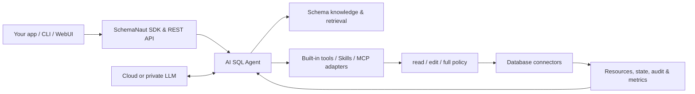

<div align="center">

# SchemaNaut

### Navigate data. Generate SQL. Operate safely.

**The open-source agent runtime for databases.**

[](CHANGELOG.md)
[](LICENSE)
[](package.json)
[](packages/sdk/src/index.ts)

[中文](README.zh-CN.md) · [SDK Guide](docs/sdk/README.md) · [API Reference](docs/sdk/api-reference.md) · [Contributing](CONTRIBUTING.md)

</div>

SchemaNaut turns a database into a tool an AI Agent can understand and operate. It combines natural-language SQL, a versioned Schema knowledge catalog, safe execution, durable sessions, and database operations behind an embeddable TypeScript SDK and local REST service.

It is designed for applications and automation—not as another database IDE. Start with PostgreSQL today, then extend the same resource, capability, and connector contracts to additional databases, warehouses, and clusters.

> SchemaNaut is in alpha. The code is open for evaluation and development, but the current release is not production-ready.

## Why SchemaNaut

| Capability | What it provides |
| --- | --- |
| AI SQL Agent | ReAct-based planning, on-demand Schema retrieval, data-shape exploration, SQL generation, execution feedback, and repair |
| Knowledge-aware retrieval | Hierarchical database → schema → relation → column catalog, business knowledge placement, hybrid retrieval, and Merkle-based version checks |
| Explicit authority | Three progressive modes: `read`, `edit`, and `full`; out-of-mode actions request approval through your callback |
| Database runtime | Connection profiles, query jobs, paged results, cancellation, sticky transactions, observations, operations, audit, and metrics |
| Durable conversations | SQLite-backed session history, automatic context compaction near the model window, manual compaction, and recoverable checkpoints |
| Model portability | OpenAI-compatible providers, SiliconFlow, DeepSeek, Zhipu, Moonshot, Ollama, vLLM, and native Anthropic Messages |
| Extension foundations | Built-in tools and Skills today, with MCP and user-imported Skill foundations for future governance and operations |
| Product surfaces | TypeScript SDK and REST API first; CLI and a lightweight local WebUI for startup, configuration, and evaluation |

## Architecture



## Quick start

Requirements: Node.js 22.5+, pnpm 9+, PostgreSQL, and a model with tool-calling support for Agent runs.

The public npm package is **not published yet**. Build the installable archive locally:

```bash
pnpm install
pnpm package:npm
npm install ./release/SchemaNaut-v0.1.0/schemanaut-v0.1.0.tgz
```

The planned public package name is `@nwlworkshop/schemanaut`.

### Run an AI SQL Agent

```ts
import {
  DatabaseAgentRuntime,
  createProviderFromPreset,
} from '@nwlworkshop/schemanaut';

const runtime = new DatabaseAgentRuntime({
  tenantId: 'team-a',
  provider: createProviderFromPreset('siliconflow', {
    apiKey: process.env.LLM_API_KEY,
  }),
  model: process.env.LLM_MODEL!,
  sessionDatabasePath: './data/schemanaut.db',
  approvalProvider: async ({ mode, tool }) => {
    // Connect this callback to your own dialog, workflow, or approval service.
    console.log(`Approval requested: ${mode} -> ${tool.name}`);
    return false;
  },
});

await runtime.connect({
  host: process.env.DB_HOST ?? '127.0.0.1',
  port: Number(process.env.DB_PORT ?? 5432),
  database: process.env.DB_NAME!,
  username: process.env.DB_USER!,
  password: process.env.DB_PASSWORD,
  readOnly: true,
});

await runtime.indexSchema();

const run = await runtime.runAgent({
  userId: 'user-1',
  message: 'Show daily paid order revenue for the last seven days.',
  mode: 'read',
});

console.log(run.result.finalText);
console.log(run.result.toolExecutions);
await runtime.close();
```

SchemaNaut stores the complete session history. Continue a conversation with `sessionId`, or compact the model's working context without deleting the original transcript:

```ts
const sessionId = run.result.session.id;

const continued = await runtime.runAgent({
  sessionId,
  message: 'Now compare it with the previous seven days.',
  mode: 'read',
});

await runtime.compactAgentSession({
  sessionId,
  focus: 'Preserve executed SQL, exact results, decisions, and open tasks.',
});
```

### Generate first, execute explicitly

For a deterministic two-step flow, use `generate()` and `executeGenerated()`:

```ts
const generated = await runtime.generate({
  question: 'Find the ten customers with the highest paid revenue this month.',
});

console.log(generated.sql, generated.safety, generated.evidence);

if (generated.status === 'awaiting_execution') {
  const executed = await runtime.executeGenerated(generated.runId, { limit: 100 });
  console.table(executed.execution.rows);
}
```

### Start the local API and WebUI

From source:

```bash
pnpm dev
```

From the local archive:

```bash
npx --yes --package ./release/SchemaNaut-v0.1.0/schemanaut-v0.1.0.tgz schemanaut
```

Open <http://127.0.0.1:3721>. The server listens on loopback only. Use `--port 3722` to select another port.

## Permission modes

| Mode | Automatic authority | What happens outside the mode |
| --- | --- | --- |
| `read` | Inspect Schema and data; execute read-only SQL | Requests approval |
| `edit` | Everything in `read`, plus `INSERT`, `UPDATE`, and other data edits | DDL, destructive, and administrative actions request approval |
| `full` | Read, data edits, DDL, destructive, and administrative tools | Runs within the configured database account and Skill policies |

The mode is an application policy, not a replacement for database permissions. Use a least-privilege database account and implement `approvalProvider` whenever an interactive or organizational approval is required.

## Public surfaces

- **SDK:** `DatabaseAgentRuntime`, unified database and resource runtimes, model providers, public contracts, errors, and portable transport helpers.
- **REST API:** model setup and calls, connection profiles, discovery, resources, query jobs, transactions, operations, Agent sessions, SQL generation, and execution.
- **CLI:** starts the local server and WebUI.
- **WebUI:** a deliberately lightweight local evaluation and configuration surface.

See the [complete SDK guide](docs/sdk/README.md) and [API reference](docs/sdk/api-reference.md).

## Development and verification

```bash
pnpm typecheck
pnpm lint
pnpm test
pnpm test:ai-sql
pnpm test:ai-sql:performance
pnpm test:npm-package:functional
```

Real PostgreSQL and live-model suites are opt-in:

```bash
pnpm test:postgres
pnpm test:functional:live
pnpm test:performance:live
```

Live model tests can consume paid tokens. Credentials are read from ignored environment files and must never be committed.

## Current boundaries

- PostgreSQL is the first complete reference connector. The contracts cover databases, warehouses, and clusters; additional production connectors remain roadmap work.
- MCP and user-imported Skill foundations exist in the core, but are not yet exposed through every public SDK/API workflow.
- Secrets are still primarily process-local. Multi-tenant authentication, persistent secret management, and production hardening are not complete.
- Agent quality depends on the selected model's SQL reasoning and tool-calling behavior.

## Documentation

- [SDK Guide](docs/sdk/README.md)
- [SDK API Reference](docs/sdk/api-reference.md)
- [Product Functional Design](docs/product-functional-overview.md)
- [AI SQL Engineering Documentation](docs/ai-sql/README.md)
- [LLM Platform](docs/foundation/01-llm-platform.md)
- [Database Access](docs/foundation/02-database-access.md)
- [Unified Resource and State Model](docs/foundation/03-unified-resource-state.md)
- [Public Types and Contracts](docs/foundation/04-public-types-and-contracts.md)
- [Security Policy](SECURITY.md)
- [Contributing](CONTRIBUTING.md)

## License

SchemaNaut is licensed under the [Apache License 2.0](LICENSE).
