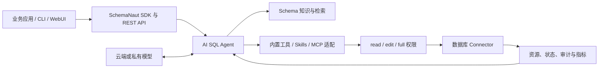

<div align="center">

# SchemaNaut

### 理解数据库，生成 SQL，安全执行与运维

**面向数据库的开源 Agent 运行时。**

[](CHANGELOG.md)
[](LICENSE)
[](package.json)
[](packages/sdk/src/index.ts)

[English](README.md) · [SDK 指南](docs/sdk/README.zh-CN.md) · [API 参考](docs/sdk/api-reference.zh-CN.md) · [参与贡献](CONTRIBUTING.md)

</div>

SchemaNaut 将数据库变成 AI Agent 能理解、能操作的工具。它把自然语言转 SQL、版本化 Schema 知识目录、安全执行、持久会话和数据库运维能力统一到可嵌入的 TypeScript SDK 与本地 REST 服务中。

它面向应用集成和自动化，而不是再造一个数据库 IDE。当前从 PostgreSQL 开始，未来通过同一套资源、能力和 Connector 合同扩展到更多数据库、数仓与集群。

> SchemaNaut 目前处于 Alpha 阶段。代码可用于评估和开发，但当前版本尚未达到生产就绪标准。

## 为什么是 SchemaNaut

| 能力 | 提供的效果 |
| --- | --- |
| AI SQL Agent | 基于 ReAct 的规划、按需检索 Schema、探索数据形态、生成 SQL、执行反馈和错误修正 |
| 知识增强检索 | 数据库 → Schema → 关系 → 列的分层目录、业务知识挂载、混合检索和基于 Merkle 的版本验证 |
| 明确的执行权限 | `read`、`edit`、`full` 三级递进权限；超出当前模式的动作通过回调向用户申请批准 |
| 数据库运行时 | 连接档案、查询任务、分页结果、取消、粘性事务、状态观测、运维操作、审计与指标 |
| 长期会话 | SQLite 保存完整历史；接近模型窗口时自动压缩，也可手动压缩并保留可恢复检查点 |
| 模型兼容 | OpenAI-compatible、硅基流动、DeepSeek、智谱、Moonshot、Ollama、vLLM 与 Anthropic 原生协议 |
| 扩展基础 | 当前包含内置 Tools 与 Skills，并为后续治理运维准备 MCP 和用户 Skill 导入基础 |
| 产品入口 | 以 TypeScript SDK 和 REST API 为核心；CLI 与轻量本地 WebUI 负责启动、配置和试用 |

## 架构



## 快速开始

要求：Node.js 22.5+、pnpm 9+、PostgreSQL；运行 Agent 时，模型需要具备 Tool Calling 能力。

公开 npm 包**尚未发布**。现在可以从源码生成可安装的本地包：

```bash
pnpm install
pnpm package:npm
npm install ./release/SchemaNaut-v0.1.0/schemanaut-v0.1.0.tgz
```

计划使用的公开包名是 `@nwlworkshop/schemanaut`。

### 运行 AI SQL Agent

```ts
import {
  DatabaseAgentRuntime,
  createProviderFromPreset,
} from '@nwlworkshop/schemanaut';

const runtime = new DatabaseAgentRuntime({
  tenantId: 'team-a',
  provider: createProviderFromPreset('siliconflow', {
    apiKey: process.env.LLM_API_KEY,
  }),
  model: process.env.LLM_MODEL!,
  sessionDatabasePath: './data/schemanaut.db',
  approvalProvider: async ({ mode, tool }) => {
    // 在这里接入你自己的弹窗、工作流或审批服务。
    console.log(`请求批准：${mode} -> ${tool.name}`);
    return false;
  },
});

await runtime.connect({
  host: process.env.DB_HOST ?? '127.0.0.1',
  port: Number(process.env.DB_PORT ?? 5432),
  database: process.env.DB_NAME!,
  username: process.env.DB_USER!,
  password: process.env.DB_PASSWORD,
  readOnly: true,
});

await runtime.indexSchema();

const run = await runtime.runAgent({
  userId: 'user-1',
  message: '查询最近 7 天每天的已支付订单金额。',
  mode: 'read',
});

console.log(run.result.finalText);
console.log(run.result.toolExecutions);
await runtime.close();
```

SchemaNaut 会保存完整 Session。你可以通过 `sessionId` 继续对话，也可以压缩模型工作上下文而不删除原始历史：

```ts
const sessionId = run.result.session.id;

const continued = await runtime.runAgent({
  sessionId,
  message: '再和之前 7 天做一个对比。',
  mode: 'read',
});

await runtime.compactAgentSession({
  sessionId,
  focus: '保留已执行 SQL、精确结果、已经做出的决定和未完成事项。',
});
```

### 先生成，再显式执行

需要更确定的两阶段流程时，使用 `generate()` 和 `executeGenerated()`：

```ts
const generated = await runtime.generate({
  question: '查询本月已支付金额最高的 10 个客户。',
});

console.log(generated.sql, generated.safety, generated.evidence);

if (generated.status === 'awaiting_execution') {
  const executed = await runtime.executeGenerated(generated.runId, { limit: 100 });
  console.table(executed.execution.rows);
}
```

### 启动本地 API 与 WebUI

从源码启动：

```bash
pnpm dev
```

从本地安装包启动：

```bash
npx --yes --package ./release/SchemaNaut-v0.1.0/schemanaut-v0.1.0.tgz schemanaut
```

打开 <http://127.0.0.1:3721>。服务只监听本机回环地址；可追加 `--port 3722` 更换端口。

## 权限模式

| 模式 | 自动拥有的能力 | 超出当前模式时 |
| --- | --- | --- |
| `read` | 查看 Schema 和数据，执行只读 SQL | 请求批准 |
| `edit` | 包含 `read`，并允许 `INSERT`、`UPDATE` 等数据修改 | DDL、删除和管理操作请求批准 |
| `full` | 读取、数据修改、DDL、删除与管理工具 | 在数据库账号权限和 Skill 策略范围内直接运行 |

模式是应用层策略，不能替代数据库自身权限。请使用最小权限数据库账号；需要交互式或组织审批时，必须实现 `approvalProvider`。

## 对外使用方式

- **SDK：** `DatabaseAgentRuntime`、统一数据库与资源运行时、模型 Provider、公共合同、错误类型和无损传输工具。
- **REST API：** 模型配置与调用、连接档案、资源发现、查询任务、事务、运维操作、Agent Session、SQL 生成与执行。
- **CLI：** 启动本地服务与 WebUI。
- **WebUI：** 刻意保持轻量的本地配置和试用界面。

完整内容见 [SDK 指南](docs/sdk/README.zh-CN.md) 与 [API 参考](docs/sdk/api-reference.zh-CN.md)。

## 开发与验证

```bash
pnpm typecheck
pnpm lint
pnpm test
pnpm test:ai-sql
pnpm test:ai-sql:performance
pnpm test:npm-package:functional
```

真实 PostgreSQL 与真实模型测试按需运行：

```bash
pnpm test:postgres
pnpm test:functional:live
pnpm test:performance:live
```

真实模型测试会消耗付费 Token。凭据只从已忽略的环境文件读取，禁止提交到仓库。

## 当前边界

- PostgreSQL 是首个完整参考 Connector。统一合同已经覆盖数据库、数仓与集群，但更多生产级 Connector 仍属于后续工作。
- MCP 和用户 Skill 导入基础已经存在于核心模块，但尚未贯通全部公开 SDK/API 流程。
- Secret 当前主要保存在进程内；多租户认证、持久化 Secret 管理和生产加固尚未完成。
- Agent 效果取决于所选模型的 SQL 推理和 Tool Calling 能力。

## 文档

- [SDK 指南](docs/sdk/README.zh-CN.md)
- [SDK API 参考](docs/sdk/api-reference.zh-CN.md)
- [产品总体功能设计](docs/product-functional-overview.md)
- [AI SQL 工程文档](docs/ai-sql/README.md)
- [大模型能力](docs/foundation/01-llm-platform.md)
- [数据库接入](docs/foundation/02-database-access.md)
- [统一资源与状态模型](docs/foundation/03-unified-resource-state.md)
- [公共类型与合同](docs/foundation/04-public-types-and-contracts.md)
- [安全策略](SECURITY.md)
- [参与贡献](CONTRIBUTING.md)

## 许可证

SchemaNaut 使用 [Apache License 2.0](LICENSE)。
