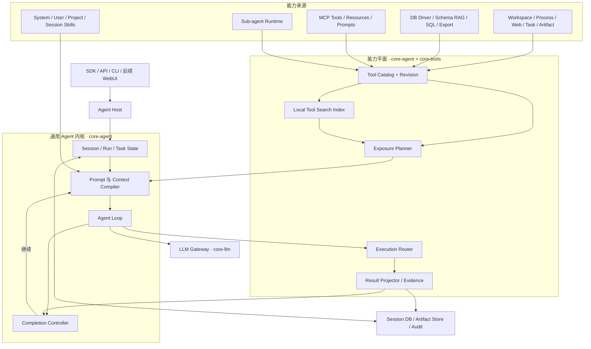
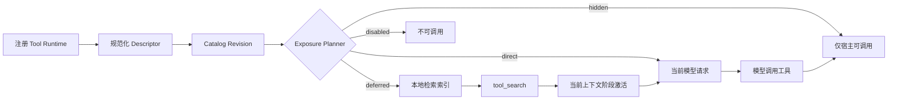
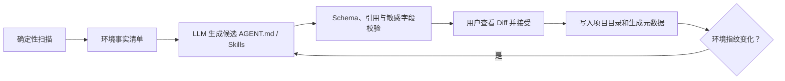

# 通用数据库 Agent 工具系统调研与改造技术指导

> 状态：已落实为首版运行时基线；确定性、真实数据库与真实模型验收以测试链路报告为准
> 调研日期：2026-07-31
> 实施日期：2026-08-01
> 适用范围：SchemaNaut Agent、Tools、Skills、MCP、LLM Provider、SDK、CLI 及后续数据库治理/运维扩展

阅读建议：产品与架构评审先看第 1、7、8、14 节；工程改造看第 9～12 节；调研证据与限制看第 2、4～6、15 节。

## 1. 结论

SchemaNaut 不应继续被实现为“只会生成和执行 SQL 的 Agent”，而应形成：

> 通用技术 Agent 内核 + 数据库专业能力包 + 项目级 Skills + 外部 MCP 能力。

数据库连接、Schema RAG、SQL 执行仍是第一专业能力，但不再写死到通用系统提示词、通用循环和通用完成判断中。未来 PostgreSQL/MySQL/数仓、Kafka、Kubernetes、权限治理、运维诊断、代码生成和数据服务都通过同一能力目录接入。

本次调研形成七项架构结论：

1. **工具可以很多，单次给模型的工具必须少。** 完整工具目录留在本地，模型只看到少量常驻工具和当前任务已发现的工具。
2. **工具注册、模型暴露和工具执行必须拆开。** 工具存在于 Runtime，不代表每轮都把完整 JSON Schema 发给模型。
3. **客户端本地发现是兼容基线，Provider 原生延迟加载只是加速项。** 国内 Provider、第三方中转站和 Ollama 不得因为“兼容 OpenAI API”就被推断为支持原生 `tool_reference`、namespace 或 deferred tools。
4. **系统提示词只定义通用工作协议。** 数据库方言、项目环境和最佳工具路径由数据库能力包、项目说明和按需 Skills 提供；权限与强制规则由代码执行。
5. **Skills、MCP、Tools 分工不同。** Skill 是按需加载的 Markdown 工作流；MCP 是标准外部能力协议；内置 Tool 是产品进程内的稳定基础能力，三者不能互相冒充。
6. **模型结果、用户结果、持久摘要和审计证据必须分离。** 大查询结果、终端日志和文件产物不进入对话历史；模型只拿完成任务需要的有界投影。
7. **自主性来自循环、状态和反馈，不来自堆提示词。** 模型负责规划和选择动作，Runtime 负责权限、调度、取消、证据和终止状态，Skills 只提示更优路径。

## 2. 调研边界与证据等级

| 对象                    | 调研基线                                                                                                            | 可以确认的内容                                                                           | 不能宣称的内容                                                              |
| ----------------------- | ------------------------------------------------------------------------------------------------------------------- | ---------------------------------------------------------------------------------------- | --------------------------------------------------------------------------- |
| OpenAI Codex            | 官方仓库提交 [`ef293f7`](https://github.com/openai/codex/tree/ef293f7ac9d756f793f3e952a790f9bec16a6eeb)，Apache-2.0 | Rust 源码中的工具注册、暴露规划、搜索、并发、Hooks、Skills、项目说明、MCP 和进程输出处理 | 未在源码中出现或仅由产品表现猜测的内部策略                                  |
| Claude Code / Agent SDK | 官方文档、官方 SDK 仓库、`@anthropic-ai/claude-agent-sdk@0.3.220` 发布元数据和变更日志                              | 对外行为合同、工具集合、工具搜索、Skills、项目记忆、MCP、并发和子 Agent 行为             | Claude Code 闭源核心的具体内部类、算法和源码组织                            |
| MCP                     | 当前稳定版 2025-11-25 官方协议                                                                                      | 生命周期、能力协商、Tools/Resources/Prompts、分页、`list_changed`、Tasks 与结构化结果    | 2026-07-28 RC 尚未成为 Current 的行为，或某个第三方 Server 未声明的扩展行为 |
| SchemaNaut              | 当前 `dev` 工作区                                                                                                   | 现有代码链路、合同和测试行为                                                             | 尚未实现的目标架构                                                          |

Claude Agent SDK 当前通过各平台可选依赖分发原生运行时，仓库说明其使用受 Anthropic Commercial Terms 约束。因此本文只借鉴公开行为合同，不复制 Claude Code 提示词或闭源实现。

## 3. 改造前实现盘点

本节保留 2026-07-31 的改造前基线，用于解释后续决策，不代表当前代码状态。当前实现映射见第 10 节，验收证据见第 12 节及 [`docs/test-pipeline.md`](../test-pipeline.md)。

### 3.1 应保留的基础

| 已有能力                          | 当前代码                                                                                                                                                                                                       | 结论                                                                    |
| --------------------------------- | -------------------------------------------------------------------------------------------------------------------------------------------------------------------------------------------------------------- | ----------------------------------------------------------------------- |
| Session、Run、Checkpoint 与持久化 | [`types.ts`](../../packages/core-agent/src/types.ts)、[`session-store.ts`](../../packages/core-agent/src/session-store.ts)、[`run-coordinator.ts`](../../packages/core-agent/src/run-coordinator.ts)           | 保留，扩充工具激活版本和通用终止状态                                    |
| 读/编辑/完全权限和单次批准        | [`permission-manager.ts`](../../packages/core-agent/src/permission-manager.ts)、[`tool-execution-authorization.ts`](../../packages/core-agent/src/tool-execution-authorization.ts)                             | 保留，继续与 Agent 推理分离                                             |
| 工具结果最小投影                  | [`tool-result.ts`](../../packages/core-agent/src/tool-result.ts)、[`ai-sql-tools.ts`](../../packages/core-tools/src/ai-sql-tools.ts)                                                                           | 方向正确，增加用户投影、Artifact 和通用证据                             |
| Markdown Skills 分层              | [`skill-registry.ts`](../../packages/core-skills/src/skill-registry.ts)、[`types.ts`](../../packages/core-skills/src/types.ts)                                                                                 | 已具备 system/user/project/session 优先级和按需正文加载，应演进而非重写 |
| 官方 MCP SDK 接入                 | [`mcp-client-launcher.ts`](../../packages/core-tools/src/mcp-client-launcher.ts)、[`mcp-runtime-manager.ts`](../../packages/core-tools/src/mcp-runtime-manager.ts)                                             | 已支持严格能力、分页、列表变更、健康和重启，应补齐统一工具合同映射      |
| 工作区、Web、子 Agent 工具        | [`workspace-tools.ts`](../../packages/core-tools/src/workspace-tools.ts)、[`web-tools.ts`](../../packages/core-tools/src/web-tools.ts)、[`subagent-tools.ts`](../../packages/core-tools/src/subagent-tools.ts) | 保留并补齐进程会话、Patch、能力暴露和独立上下文合同                     |
| LLM 模型元数据和上下文长度        | [`types.ts`](../../packages/core-llm/src/types.ts)、[`model-registry.ts`](../../packages/core-llm/src/model-registry.ts)                                                                                       | 保留，拆分模型能力与 Provider 协议能力                                  |

### 3.2 主要结构性问题

| 问题                                 | 当前表现                                                                                                                      | 影响                                                              |
| ------------------------------------ | ----------------------------------------------------------------------------------------------------------------------------- | ----------------------------------------------------------------- |
| 通用循环被 SQL 语义污染              | [`react-agent.ts`](../../packages/core-agent/src/react-agent.ts) 的基础提示词直接声明数据库/SQL Agent，并写入 JSON 清洗等策略 | 代码生成、Kafka、K8s、治理运维会被错误角色限制                    |
| 压缩器同样数据库化                   | [`context-manager.ts`](../../packages/core-agent/src/context-manager.ts) 固定要求保留数据库事实和 SQL                         | 通用项目任务的关键文件、命令和产物不能被同等表达                  |
| Registry 同时承担运行时与模型 Schema | [`tool-registry.ts`](../../packages/core-agent/src/tool-registry.ts) 只保存扁平名称并直接生成 `LlmTool[]`                     | 无法实现 namespace、deferred、hidden、Provider 特性和目录版本     |
| 常驻工具过多且写死                   | [`react-agent.ts`](../../packages/core-agent/src/react-agent.ts) 固定 13 个 always-visible 工具                               | 每轮持续消耗上下文，也无法按产品能力包切换                        |
| 工具搜索过弱                         | [`agent-runtime-tools.ts`](../../packages/core-tools/src/agent-runtime-tools.ts) 仅按名称和描述做字符串包含计分               | 中英文混合、参数语义、MCP 大目录和同义表达召回不足                |
| 激活永久附着 Session                 | `activeTools: string[]` 命中后永久持久化                                                                                      | 工具集合只增不减；压缩、MCP 变更和任务切换后可能过时              |
| 同一轮工具调用串行                   | [`react-agent.ts`](../../packages/core-agent/src/react-agent.ts) 逐个 `await` 工具调用                                        | 多个独立读取、检索和 MCP 查询不能并发                             |
| Shell 是一次性命令                   | [`workspace-tools.ts`](../../packages/core-tools/src/workspace-tools.ts) 只有 `shell_run`                                     | 无法承载长任务、交互进程、轮询、后台作业和有界日志                |
| 完成门禁仍偏 SQL                     | [`completion-verifier.ts`](../../packages/core-agent/src/completion-verifier.ts) 主要识别最新 `sql_execute` 和文本正则        | 文件、命令、MCP、子 Agent、治理任务缺少统一证据模型               |
| Provider 能力粒度不够                | [`core-llm/types.ts`](../../packages/core-llm/src/types.ts) 只有 tool calling、reasoning 等通用能力                           | 无法安全判断原生工具搜索、namespace、并行调用和结构化 Tool Result |

## 4. Codex 的实际实现给出的启示

### 4.1 工具目录、暴露计划和执行运行时是三件事

Codex 先构造完整 Runtime Registry，再从中生成本轮模型可见的 Tool Specs。`ToolExposure` 和 Provider/模型能力共同决定工具是直接暴露、延迟发现还是隐藏；隐藏工具仍可供宿主内部运行，但不进入模型请求。

对应源码：

- [`spec_plan.rs`](https://github.com/openai/codex/blob/ef293f7ac9d756f793f3e952a790f9bec16a6eeb/codex-rs/core/src/tools/spec_plan.rs)：根据 `supports_search_tool` 与 Provider `namespace_tools` 形成暴露计划。
- [`registry.rs`](https://github.com/openai/codex/blob/ef293f7ac9d756f793f3e952a790f9bec16a6eeb/codex-rs/core/src/tools/registry.rs)：保存运行处理器、暴露状态、Hooks 与模型可见结果。
- [`router.rs`](https://github.com/openai/codex/blob/ef293f7ac9d756f793f3e952a790f9bec16a6eeb/codex-rs/core/src/tools/router.rs)：把不同 Provider 载荷规范化后路由到同一 Registry。

SchemaNaut 应采用同样的职责分离，但不能直接照搬 Responses 专属协议。

### 4.2 工具发现搜索的不只是名称

Codex 的本地搜索索引包含工具名、去下划线名称、描述、参数名和参数描述，并对 namespace 进行合并；当前实现使用内存 BM25 和缓存。值得借鉴的是“字段化目录 + 本地确定性检索 + 目录变化重建”，不是其 English tokenizer。

对应源码：[`tool_search.rs`](https://github.com/openai/codex/blob/ef293f7ac9d756f793f3e952a790f9bec16a6eeb/codex-rs/core/src/tools/handlers/tool_search.rs)。SchemaNaut 面向中文用户，必须增加 CJK 与英文混合分词测试，不能直接采用 English 模式。

### 4.3 并发由 Runtime 决定，不由提示词决定

Codex 对可并行工具取得读锁，对不可并行工具取得写锁：读取可以重叠，修改自动串行。工具还声明取消时是否需要等待清理，Runtime 统一处理取消和结束事件。

对应源码：[`parallel.rs`](https://github.com/openai/codex/blob/ef293f7ac9d756f793f3e952a790f9bec16a6eeb/codex-rs/core/src/tools/parallel.rs)。

### 4.4 大输出不直接塞进上下文

Codex 的统一执行器管理长进程、轮询、输入和终止；大输出使用头尾保留并明确标记中间省略，而完整内容留在进程/Artifact 层。

对应源码：[`head_tail_buffer.rs`](https://github.com/openai/codex/blob/ef293f7ac9d756f793f3e952a790f9bec16a6eeb/codex-rs/core/src/unified_exec/head_tail_buffer.rs)。

### 4.5 Skills 和项目说明采用渐进加载

Codex 总是给模型 Skill 的名称和简短描述，只有明确调用或匹配后才加载正文；Skill 元数据还有与模型上下文长度相关的总量控制。项目说明从项目根目录向当前目录逐层合并，避免把整个仓库所有局部规则一次性放入上下文。

对应源码：

- [`agents_md.rs`](https://github.com/openai/codex/blob/ef293f7ac9d756f793f3e952a790f9bec16a6eeb/codex-rs/core/src/agents_md.rs)
- [`available_skills_instructions.rs`](https://github.com/openai/codex/blob/ef293f7ac9d756f793f3e952a790f9bec16a6eeb/codex-rs/core/src/context/available_skills_instructions.rs)

### 4.6 子 Agent 的价值是上下文隔离

Codex 支持新上下文和 fork 两类委派。新上下文只接收任务、环境与需要的能力；fork 会清理不适合继承的中间工具轨迹。父 Agent 最终只需要子任务结果，不需要吞入完整子会话。

对 SchemaNaut 的含义：子 Agent 可以拥有和主 Agent 相同的能力目录，但只暴露当前委派任务需要的能力；“能力相同”不等于“共享完整上下文”。

## 5. Claude Code / Agent SDK 的公开行为合同

### 5.1 工具搜索是大目录的默认路径

Claude 官方文档说明：大目录下先隐藏完整工具 Schema，搜索后通常加载 3–5 个相关工具；少于约 10 个工具时直接加载通常更快。`auto` 模式按全部工具定义占模型上下文的比例判断是否启用搜索，默认参考值是 10%。长对话压缩后，已发现工具可能退出上下文并再次发现。

这个数字只能作为对照，不能直接成为 SchemaNaut 常量；我们的工具描述长度、模型、中文分词和 Provider 均不同。

### 5.2 第三方中转站必须降级

Claude Code 在非第一方 `ANTHROPIC_BASE_URL` 下默认不使用原生 Tool Search，因为多数代理不会转发 `tool_reference`。这直接支持 SchemaNaut 的兼容策略：

- 官方 Provider 且明确声明高级能力：可以使用原生 deferred/tool reference。
- 第三方中转站、自定义 endpoint、Ollama 或能力未知：使用普通函数形式的本地 `tool_search`，下一轮由客户端加入命中的 JSON Schema。
- 不通过 endpoint 外观、模型名称或“OpenAI-compatible”字符串猜测高级能力。

### 5.3 Skills 通过一个入口运行

Claude Code 不把每个 Skill 注册成一个 Tool，而是由一个 `Skill` Tool 负责发现和加载 Markdown 内容。默认只常驻名称与描述；用户可以 `/name` 直接调用，也可以禁止模型主动调用某个 Skill。

SchemaNaut 当前 Skills 分层已经正确，后续应收敛模型侧入口，而不是增加更多常驻 `skill_search`、`skill_load`、`skill_resource_read` Schema。

### 5.4 项目说明是上下文，不是强制执行器

Claude Code 将 `CLAUDE.md` 作为项目上下文注入，并按 managed、user、project、local 与目录层级加载。官方文档明确指出：模型可能不严格遵守项目说明；必须执行的动作应交给 Hooks 或 Runtime。

这与 SchemaNaut 的原则一致：提示词和 Skills 引导思路，权限、连接边界、执行合同与必需验证由代码负责。

### 5.5 工具并发和子 Agent

Claude Agent SDK 对 Read/Glob/Grep 和标记为只读的 MCP Tools 并发执行，对 Edit/Write/Bash 等修改工具串行。子 Agent 默认拥有独立上下文、自己的工具/权限/模型/MCP/Skills 配置，向父 Agent 返回结果摘要。

### 5.6 MCP 生命周期

Claude Code 默认允许 MCP Server 后台连接；任务需要仍在连接的 Server 时再等待。它支持 `list_changed`、HTTP/SSE 自动重连和大输出告警。SchemaNaut 已覆盖其中多数基础能力，缺口主要在模型暴露计划、非阻塞首轮和完整 MCP 元数据投影。

## 6. MCP 的标准边界

MCP 官方版本页在本次调研时仍将 2025-11-25 标记为 Current；2026-07-28 是 Release Candidate。实现以 Current 为兼容基线，同时保持版本协商，避免把“有状态 Session”写死到 MCP Adapter 之外，以便未来适配 RC 提议的无状态核心和 Extensions。

MCP 2025-11-25 对三类 Server 能力的控制关系很清楚：

| 原语      | 控制方   | SchemaNaut 中的用途                        |
| --------- | -------- | ------------------------------------------ |
| Prompts   | 用户控制 | 可作为显式命令/模板，不自动替代系统提示词  |
| Resources | 应用控制 | 项目、监控、目录和外部知识的有界上下文来源 |
| Tools     | 模型控制 | Agent 可自主调用的外部动作                 |

在当前稳定版中，每个 Client 与 Server 是独立、有状态的一对一 Session；Host 保留完整对话并负责多个 Client 的隔离。初始化必须完成版本与能力协商，Tools 列表支持分页和 `notifications/tools/list_changed`。2025-11-25 还引入实验性 Tasks，可表达长时间运行、轮询与延迟取回结果，但接入前必须由双方能力声明确认。

因此：

- 不需要把内置 Tool 包装成 MCP 才能调用。
- 用户自建 MCP Server 应严格走官方协议，而不是自创相似 JSON。
- MCP 的 `outputSchema`、`structuredContent` 和 annotations 应进入统一工具合同，但远端 annotations 只是元数据，最终权限仍由本地三档模式计算。

## 7. 方案取舍

| 机制                         | Codex                    | Claude Code                      | SchemaNaut 决策                                  |
| ---------------------------- | ------------------------ | -------------------------------- | ------------------------------------------------ |
| Registry 与模型可见工具分离  | 源码确认                 | 行为确认                         | 采用                                             |
| 原生 deferred/tool reference | Provider 能力门控        | 第三方 endpoint 自动降级         | 仅作为可选加速                                   |
| 本地工具搜索                 | BM25，English            | 官方托管搜索行为                 | 自建中英文本地索引，Provider 无关                |
| 全量工具直传                 | 小目录可用               | 少于约 10 个可能更快             | 仅在 Schema 很小且低于上下文占用门限时使用       |
| Skill 元数据常驻、正文按需   | 采用                     | 采用                             | 保留现有分层并收敛模型入口                       |
| 项目说明分层                 | AGENTS.md 根到当前目录   | CLAUDE.md 根到当前目录、局部按需 | 扩展 `.schemanaut/AGENT.md` 与 path-scoped rules |
| 并行读取、串行修改           | Runtime 锁               | SDK 调度                         | 采用，并增加资源级并发组                         |
| 统一长进程                   | 支持后台、轮询、输入     | Bash/Tasks 支持                  | 替换当前一次性 `shell_run`                       |
| 子 Agent                     | fresh/fork、独立 Session | 独立上下文、摘要回传             | 采用，同能力目录、独立暴露计划                   |
| Claude Code 实现代码         | 不适用                   | 闭源/商业条款                    | 不复制，只按公开合同自行实现                     |

## 8. 目标架构



架构边界：

- `core-agent` 只理解通用消息、任务、工具、结果、证据和终止状态。
- `core-tools` 提供内置能力及 MCP 适配，不把数据库业务写回 Agent 内核。
- `core-db`、`core-resource`、`core-rag` 作为 Database Capability Provider 注册专业工具。
- `core-skills` 管理 Markdown 内容、作用域和按需加载。
- `core-llm` 决定 Provider/模型实际支持的消息与工具协议。
- `sdk` 组合能力包，CLI/API 只消费公共合同。

## 9. 核心技术设计

### 9.1 Prompt 与上下文分层

上下文编译器按以下顺序组合，不再由 `react-agent.ts` 拼接数据库专用字符串：

| 层级                 | 内容                                              | 加载方式                         | 是否强制                  |
| -------------------- | ------------------------------------------------- | -------------------------------- | ------------------------- |
| Runtime Protocol     | 工具调用、结果、终止、许可交互等通用协议          | 每轮最小固定片段                 | 是，由代码配合保证        |
| Managed Policy       | 部署方不可被项目覆盖的规则                        | 配置加载                         | 是，由 Runtime/Hooks 执行 |
| User System Profile  | 用户自定义角色，可选择 append 或 replace 默认人格 | Session/项目配置                 | 软约束                    |
| Project Instructions | 项目结构、约定、环境说明                          | 根到当前工作目录；局部按访问加载 | 软约束                    |
| Relevant Memory      | 与当前请求相关的长期偏好                          | 检索后有界注入                   | 软约束                    |
| Skill Body           | 某类任务的推荐工作流和工具组合                    | 显式 `/skill` 或模型按需加载     | 软约束                    |
| Live Facts           | Schema、数据形态、监控和外部系统状态              | RAG/Tools/MCP 实时读取           | 事实证据                  |

完整替换用户系统提示词时，仍保留不可删除的 Runtime Protocol；否则工具回传和终止合同可能失效。数据库清洗规则、方言和“应该先做什么”不得写进通用层。

上下文压缩只根据模型的**真实有效输入容量**触发：

```text
有效输入容量 = 模型最大上下文 - 预留输出 - Provider 协议开销
```

上下文长度来源按“Provider 模型元数据 → 内置官方目录 → 用户覆盖”解析；不通过真实对话探针获取。这里没有金额或人为会话 Token 预算。压缩器改为通用语义检查点，并由当前能力包附加需要保留的领域事实。

### 9.2 统一工具合同

目标合同至少分成描述与执行两部分：

```ts
type ToolExposure = 'direct' | 'deferred' | 'hidden' | 'disabled';

type ToolId = {
  namespace?: string;
  name: string;
};

type ToolDescriptor = {
  id: ToolId;
  title?: string;
  description: string;
  inputSchema: JsonSchema;
  outputSchema?: JsonSchema;
  source: 'builtin' | 'database' | 'rag' | 'mcp' | 'sdk';
  sourceId?: string;
  annotations: {
    readOnly: boolean;
    destructive?: boolean;
    idempotent?: boolean;
    openWorld?: boolean;
  };
  search: {
    aliases?: string[];
    tags?: string[];
    examples?: string[];
  };
  execution: {
    concurrencyGroup?: string;
    cancellable: boolean;
    backgroundCapable?: boolean;
    taskSupport?: 'forbidden' | 'optional' | 'required';
  };
};

type ToolRuntime = {
  execute(input: ToolInvocation, context: ToolExecutionContext): Promise<ToolExecutionResult>;
};
```

`ToolId` 在内部保持 namespace 结构，只有 Provider Adapter 最后一步才扁平化名称。目录维护单调递增的 `catalogRevision`；MCP `list_changed`、SDK 动态注册和能力启停都会生成新版本。

### 9.3 工具暴露与发现



暴露计划遵循以下顺序：

1. 先应用运行范围、产品能力包、用户配置和 Provider 限制。
2. 仅当存在 deferred 工具时加入 `tool_search`。
3. 常驻少量控制面工具；数据库能力包可以固定少数黄金链路工具，但不再由通用 Agent 写死。
4. 对全部候选 JSON Schema 估算实际 Token；同时满足“小工具数”和“低上下文占用”才允许直接全量加载。
5. 其余工具进入本地索引；命中后在下一轮加入模型请求。
6. 激活状态绑定 `catalogRevision + contextCheckpointSequence + taskEpoch`。目录变化、上下文压缩或新任务开始后重新计算，不再永久累加 `activeTools`。

用于首轮评测的常驻候选不超过 8 个：`tool_search`、统一 `task`、统一 `skill`、`workspace_read`、`workspace_search`，再由 Database Profile 固定 `knowledge_search`、`resource_get`、`sql_execute`。Ask User 和 Approval 继续走 Host 事件，不额外占用 Tool Schema。这个集合是评测起点，不是不可调整的产品规则。

本地索引字段：namespace、名称、标题、描述、别名、标签、参数名、参数描述、来源和 Server 简介。第一阶段不使用 Embedding 做首跳搜索，避免额外 Provider 依赖、费用和不确定延迟；大规模模糊目录可在本地词法召回后增加可选 rerank。

候选实现：

- [MiniSearch](https://github.com/lucaong/minisearch)：MIT、零依赖、支持字段权重/模糊/前缀和自定义 tokenizer，包较轻。
- [Orama](https://github.com/oramasearch/orama)：Apache-2.0、BM25，并提供[中文 tokenizer](https://docs.orama.com/docs/orama-js/supported-languages/using-chinese-with-orama)，能力更完整但包更大。

不在文档阶段锁定依赖。先抽象 `ToolSearchIndex`，用同一组中英双语标注集比较 Recall、MRR、延迟和打包体积后选择。

### 9.4 Provider 能力与中转站降级

当前 `LlmProviderCapabilities` 应拆成：

- `ModelCapabilityProfile`：tool calling、reasoning、上下文长度、最大输出、并行工具调用等模型属性。
- `ProviderProtocolProfile`：OpenAI Chat/Responses、Anthropic Messages、Ollama 等协议，以及 namespace、native deferred、tool reference、结构化 Tool Result、服务端 Web Search、Prompt Cache 等传输属性。
- `EffectiveCapabilityProfile`：两者与用户显式覆盖的交集。

| 接入类型                     | 默认工具发现方式              | 原生 deferred 条件                                 |
| ---------------------------- | ----------------------------- | -------------------------------------------------- |
| OpenAI 官方 Responses        | 客户端本地发现可用            | 官方元数据明确支持 namespace/tool search 时可启用  |
| Anthropic 官方 Messages      | 客户端本地发现可用            | 模型与官方 endpoint 都声明 tool reference 时可启用 |
| OpenAI-compatible 中转站     | 客户端本地发现                | 默认关闭；只有用户/Provider 元数据明确声明才打开   |
| Anthropic-compatible 中转站  | 客户端本地发现                | 默认关闭                                           |
| SiliconFlow、Ollama、vLLM 等 | 普通函数调用 + 客户端本地发现 | 逐 Provider 明确适配，不能仅凭 endpoint 猜测       |
| 未知自定义 endpoint          | 最保守的普通函数合同          | 默认关闭                                           |

原生能力失败时只对当前 Provider Profile 熔断并切回客户端发现，不应让整个 Agent 失败，也不能把兼容问题误报为模型不会使用工具。

### 9.5 Execution Router、并发与 Hooks

模型一轮返回多个 Tool Calls 后：

1. Router 解析并验证参数，保留原始 call id。
2. PreTool Hook 可以补充环境、改写参数或拒绝，但不替代三档权限判断。
3. Permission Manager 按 `read/edit/full` 和工具实际参数计算所需权限。
4. 只读、无冲突且允许并行的调用进入读并发；修改调用按资源组串行。
5. Runtime 执行、超时、取消和清理。
6. PostTool Hook 只影响回传和后续上下文；已经完成的外部动作不能被伪装为“未执行”。
7. Result Projector 生成模型、用户、持久与审计四类结果。

并发不能只有一个全局布尔值。建议使用 `concurrencyGroup`：

- 文件修改按 workspace 串行。
- 同一数据库连接的写操作串行；只读查询还受连接池并发上限控制。
- 同一 MCP Server 可采用 Server 声明和本地限制。
- 无状态的 RAG/Web/文件读取可以并行。

### 9.6 通用进程工具

当前 `shell_run` 应演进为统一 Process Runtime，而不是继续增加多个 Shell 变体：

| 动作                | 作用                                |
| ------------------- | ----------------------------------- |
| `process_exec`      | 启动前台或后台命令，返回 process id |
| `process_poll`      | 获取新增输出和当前状态              |
| `process_write`     | 向交互进程写入 stdin                |
| `process_terminate` | 终止指定进程并等待清理              |

完整 stdout/stderr 写入有界 spool 或 Artifact；模型得到头尾投影、退出码、耗时和省略计数。CLI/API 可流式显示用户需要的命令、SQL、进度和错误，但不展示内部打分、哈希或隐藏规划数据。

### 9.7 工具结果与产物

保留现有 `AgentToolResultEnvelope` 思路并扩展为：

| 投影             | 消费者             | 内容                                                                      |
| ---------------- | ------------------ | ------------------------------------------------------------------------- |
| Model Projection | 下一轮模型         | 最多约 100 行/有界文本、结构、错误和继续决策所需证据                      |
| User Projection  | CLI/API/WebUI      | SQL、执行状态、默认最多 1000 行预览、可分页 Result Handle、可见命令和产物 |
| Durable Summary  | Session 恢复与压缩 | 无大结果、无临时 Handle 的稳定摘要                                        |
| Artifact         | 文件/对象存储      | CSV、完整日志、SQL 脚本、代码、报告等大内容                               |
| Audit Evidence   | 内部审计和测试     | 参数摘要、权限、耗时、结果类型、失败分类和关联 id                         |

查询结果继续由执行引擎单独返回，不写入对话或用户偏好。Agent 需要更多数据时通过 Result Handle 分页、采样或导出工具继续读取，而不是要求模型记住全部结果。

每个 Result/Process Handle 必须声明 Session 归属、状态、过期时间和是否可跨重启恢复。不能持久化的 Handle 在恢复 Session 后明确返回 `expired` 并给出重新执行入口，不能让历史消息看起来仍然可读。

### 9.8 工具家族

完整目录可以持续扩张，模型暴露面由 Exposure Planner 控制。

| 家族      | 建议能力                                                      | 默认暴露                                |
| --------- | ------------------------------------------------------------- | --------------------------------------- |
| Control   | task state、ask user、approval handshake、tool search         | 极少量常驻                              |
| Skill     | 查找/调用 Skill、读取 Skill bundle resource                   | 一个模型侧入口，正文按需                |
| Workspace | list、read、search、write、edit、apply patch、diff            | 读取按产品配置直载或延迟；修改延迟      |
| Process   | exec、poll、write、terminate                                  | 延迟，调用后保持运行时状态              |
| Web       | search、fetch                                                 | Host Adapter 可用时延迟                 |
| Database  | resource、Schema RAG、SQL execute/explain、result page/export | Database Profile 固定黄金链路，其余延迟 |
| MCP       | Tools、Resources、Prompts                                     | 目录化并默认延迟                        |
| Sub-agent | spawn/fork、list、wait、message、interrupt                    | 复杂任务时加载                          |
| Artifact  | create/list/read/export                                       | 少量通用入口或按需加载                  |

LSP、Notebook、浏览器控制、Kubernetes 和 Kafka 不必一次写进内核；它们可以由后续内置 Provider、MCP 或项目 Skill 组合接入。

### 9.9 Skills 与项目自动生成

保留现有四级 Skills：

```text
system < user < project < session
```

模型侧建议使用统一 `skill` 入口，支持搜索、加载和资源读取；CLI 继续支持 `/name`。Skill 正文只在使用时进入当前上下文，压缩后若任务仍依赖该 Skill，则由 Context Compiler 重新加载，不依赖历史消息碰巧保留。

项目初始化增加 Project Compiler，但它不是“让模型凭空写配置”：



确定性扫描包括项目语言/构建工具、数据库类型和版本、已配置连接、可用资源、MCP Server、目录结构等。生成文件保存输入指纹、模板版本、模型和生成时间，更新时提供 Diff。

生成 Skill 只描述项目工作流、方言注意点和推荐 Tool 组合；实时 Schema、统计量、监控状态、密钥和大量样例仍留在 RAG/Tools，不复制进 Markdown。数据库新建或 ALTER 后由 Schema 一致性链路更新事实，Skill 不承担实时元数据同步。

### 9.10 MCP 融合

现有 MCP Runtime 不需要重写，也不需要另建 `core-mcp` 包。应完成以下融合：

1. `McpToolSpec.outputSchema`、structured content、annotations 和 `execution.taskSupport` 完整投影到 `ToolDescriptor`/Result。
2. Server、Tool 使用结构化 namespace，Provider 扁平名称只是适配结果。
3. `list_changed` 更新 Catalog Revision，并使旧激活失效。
4. 默认非阻塞启动；搜索命中尚未就绪的 Server 时等待或返回明确 pending 状态。
5. HTTP/SSE/stdio 生命周期继续由官方 SDK 管理。
6. OAuth、Elicitation、Sampling、Roots 和实验性 Tasks 按协商结果与真实产品场景逐项接入，不提前伪造协议。
7. 持续跟踪 2026-07-28 RC；只有其成为 Current 且官方 TypeScript SDK 稳定支持后，才迁移无状态核心和 Extensions。

### 9.11 子 Agent

子 Agent 使用同一个 Agent Kernel、Tool Catalog 和权限体系，区别是：

- 默认新建独立 Session/上下文，只接收任务说明、项目上下文和必要 Skills。
- 需要继承讨论时显式 fork，并清理无用中间 Tool Calls。
- 每个子 Agent 有独立的 Exposure Plan、Token 使用、取消信号和完成状态。
- 父 Agent 默认只接收结构化结果摘要和 Artifact 引用。
- 支持 list、wait、message、interrupt；深度和并发容量由 Host 限制。

这既保持“子 Agent 与主 Agent 能力相同”，又避免把父会话全部复制到每个子任务。

### 9.12 通用完成控制

计划、证据和终止仍由三方协作：

- **模型**：生成/修改计划，判断下一步，提出候选最终回答。
- **Tool Runtime**：产生不可伪造的执行结果、Artifact、失败分类和领域证据。
- **Completion Controller**：检查确定性条件并产生终止状态，不替模型判断所有业务语义。

目标状态：

```text
completed | needs_user_input | terminal_failure | cancelled |
provider_error | max_turns | interrupted
```

把当前“最新 SQL 是否成功”的逻辑改成可注册 `CompletionEvidenceProvider`：数据库、文件、进程、MCP 和子 Agent 分别提供证据。文本正则只能作为兼容兜底，不能继续作为主要完成判据。

## 10. 代码改造映射

下表原本是实施清单。首版已落地 Provider Profile、Tool Descriptor/Runtime、目录 revision、Exposure Planner、本地搜索、Execution Router、通用指令与完成控制、Process Runtime、原子 Workspace Patch、统一 Skill 入口、Project Compiler、MCP 结果适配、子 Agent fresh/fork/message 与 SDK/API/CLI 合同。表中 OpenAI Responses 原生 deferred、完整跨重启 Process/Result Artifact Store，以及尚未存在的数据库/Kafka/Kubernetes能力包仍是后续扩展，不应被文档误报为已经交付。

| 模块/文件                                                                                   | 改造要点                                                                          | 保留内容                                   |
| ------------------------------------------------------------------------------------------- | --------------------------------------------------------------------------------- | ------------------------------------------ |
| [`core-llm/types.ts`](../../packages/core-llm/src/types.ts)                                 | 增加 Provider Protocol、Model Capability、有效能力和结构化 Tool Result 合同       | 现有 Chat/Stream/Embedding/Rerank 合同     |
| [`core-llm/model-registry.ts`](../../packages/core-llm/src/model-registry.ts)               | 模型上下文来源优先级、高级工具能力显式声明与用户覆盖                              | 当前模型注册和限制                         |
| 各 Provider Adapter                                                                         | 把统一工具合同映射到 OpenAI Chat/Responses、Anthropic、Ollama；原生能力失败可降级 | 当前标准 Tool Calling 与重试               |
| [`core-agent/types.ts`](../../packages/core-agent/src/types.ts)                             | ToolId、Descriptor、Exposure、Activation、通用 Result/Evidence/Terminal Status    | Session、权限、Run 公共类型                |
| [`core-agent/tool-registry.ts`](../../packages/core-agent/src/tool-registry.ts)             | 拆成 Catalog/Runtime Registry；增加 revision、namespace、生命周期事件             | 重名检测和注册入口                         |
| 新增 `tool-exposure-planner.ts`                                                             | 结合能力包、Provider、Token 估算和激活状态生成本轮 Schema                         | 无                                         |
| 新增 `tool-search-index.ts`                                                                 | 中英文字段化索引、缓存、排名、目录版本                                            | 替代简单包含计分                           |
| 新增 `tool-execution-router.ts`                                                             | 参数验证、Hooks、权限、并发组、取消、结果投影                                     | 从 `react-agent.ts` 抽出执行逻辑           |
| [`core-agent/react-agent.ts`](../../packages/core-agent/src/react-agent.ts)                 | 仅保留通用 Agent 循环和状态机；删除 SQL 专用提示词与串行执行细节                  | 自适应迭代、Session/Run 集成               |
| [`core-agent/context-manager.ts`](../../packages/core-agent/src/context-manager.ts)         | 通用 Context Compiler、领域压缩扩展、工具激活检查点                               | 模型窗口驱动压缩和持久 Checkpoint          |
| [`core-agent/completion-verifier.ts`](../../packages/core-agent/src/completion-verifier.ts) | 演进为 Completion Controller + 可注册证据 Provider                                | 最终交付不得是中间态的原则                 |
| [`core-agent/project-context.ts`](../../packages/core-agent/src/project-context.ts)         | 分层说明、path-scoped rules、Project Compiler 元数据                              | `.schemanaut`、skills/sql/artifacts 目录   |
| [`core-agent/subagent-pool.ts`](../../packages/core-agent/src/subagent-pool.ts)             | fresh/fork、message、父子图、能力/并发配置                                        | 当前持久记录、深度和取消                   |
| [`core-tools/agent-runtime-tools.ts`](../../packages/core-tools/src/agent-runtime-tools.ts) | 删除永久 `activeTools` 逻辑；工具发现迁入 Catalog/Search                          | task 工具可改为更小入口                    |
| [`core-tools/workspace-tools.ts`](../../packages/core-tools/src/workspace-tools.ts)         | 增加 apply patch/diff；Shell 拆到 Process Runtime                                 | 路径解析、文件 list/read/search/write/edit |
| 新增 `process-tools.ts`                                                                     | 前后台进程、poll/stdin/terminate、spool、头尾投影                                 | 复用现有 child process 处理经验            |
| [`core-tools/mcp-tool-adapter.ts`](../../packages/core-tools/src/mcp-tool-adapter.ts)       | 完整 Descriptor/Result 映射、结构化 namespace                                     | 当前命名冲突处理和本地权限下限             |
| [`core-tools/mcp-runtime-manager.ts`](../../packages/core-tools/src/mcp-runtime-manager.ts) | Catalog Revision、非阻塞就绪状态、工具变化失效                                    | 生命周期、健康、重启、Resources/Prompts    |
| [`core-skills`](../../packages/core-skills/src)                                             | 模型侧统一 Skill 入口、元数据上下文上限、压缩后重载、生成来源                     | 四级作用域、Markdown、热刷新、bundle 读取  |
| [`sdk/runtime.ts`](../../packages/sdk/src/runtime.ts)                                       | 组合 Capability Profiles、Project Compiler、Provider 降级、公共事件               | 当前 Runtime 组合与数据库黄金链路          |
| [`sdk/types.ts`](../../packages/sdk/src/types.ts)                                           | 暴露自定义系统提示词模式、能力包、工具 Provider、搜索与结果合同                   | 现有 provider/project/skills/MCP 配置      |
| [`apps/server/interactive-cli.ts`](../../apps/server/src/interactive-cli.ts)                | 工具/SQL/命令可见轨迹开关、`/skill`、项目初始化和诊断                             | 当前会话、批准和流事件                     |
| [`shared`](../../packages/shared/src)                                                       | 只增加已落地的公共 DTO；避免提前猜测领域字段                                      | 现有通用合同原则                           |

`core-db`、`core-resource`、`core-rag` 不需要为通用 Agent 重写；它们改为通过统一 Capability Provider 注册自己的 Tools、结果和完成证据。

## 11. 实施依赖顺序

这不是功能优先级，而是避免双轨和返工的技术依赖顺序：

1. 固化当前 SQL、RAG、Session、MCP、Skills、CLI 黄金链路测试与性能基线。
2. 先引入新 Tool Descriptor、Runtime、Provider Profile 和 Result 合同，不改变外部行为。
3. 建立 Catalog、Revision、Exposure Planner 和客户端本地搜索；旧 `activeTools` 只做迁移读取。
4. 把 Agent 基础提示词和压缩器改为通用 Context Compiler，数据库内容移入 Database Profile/Skills。
5. 把 Tool 执行从 `react-agent.ts` 抽到 Router，加入并发组、Hooks、取消和通用完成证据。
6. 建立 Process Runtime，并统一文件、Web、数据库、MCP、Artifact 的结果投影。
7. 收敛 Skill 模型入口，增加 Project Compiler；随后完善 MCP 就绪状态和子 Agent fresh/fork。
8. 更新 SDK/API/CLI 公共合同和用户轨迹。
9. 所有消费者切换后删除旧搜索、永久激活、SQL 专用通用提示词和兼容字段。

现有 `ToolRegistry`/`AgentToolDefinition` 已经是导出 API。迁移期应由单向 Legacy Adapter 把旧定义转换为新 Descriptor/Runtime，并发出弃用提示；不能长期维护两套 Registry，也不能在未记录公共 API 变更时直接静默破坏 SDK 使用方。

每一步都必须保持同一套 Agent 数据管线，不能长期保留“旧 SQL Agent”和“新通用 Agent”两套循环。

## 12. 验收与性能门禁

### 12.1 工具发现

- 至少构造 200/1000 两档工具目录，覆盖中文、英文、混合参数、相似名称、多个 MCP namespace。
- 标注不少于 100 个真实查询，目标 `Recall@5 >= 95%`、`Recall@8 >= 98%`、`MRR@5 >= 0.85`。
- 1000 工具本地搜索 `p95 < 20ms`，目录重建 `p95 < 150ms`，均不包含磁盘首次加载。
- 对 MiniSearch/Orama 使用同一数据集；若更重方案没有带来可量化召回收益，不引入额外依赖。

### 12.2 上下文与 Provider

- 记录每轮工具 Schema 的估算/真实 Token 和占模型窗口比例。
- 默认常驻工具目标少于 10 个；具体门限由评测确定，不照搬 Claude 的 10%。
- OpenAI 官方、Anthropic 官方、OpenAI-compatible 中转、SiliconFlow、Ollama 至少各有合同测试；高级能力未知时必须走客户端发现。
- 上下文压缩在有效输入容量不足时触发，手动压缩可用；压缩后能重新发现所需 Tools/Skills。

### 12.3 执行与结果

- 同轮独立读取能并发；任何同资源修改保持确定性顺序。
- 取消后进程、数据库查询和 MCP 请求完成清理，不遗留悬挂状态。
- 模型默认最多接收 100 行有界样例；用户结果预览最多 1000 行；完整结果通过 Handle/Artifact 获取。
- Session 历史不保存完整查询结果、完整终端日志或用户偏好中的结果样例。
- 工具输出分别验证 Model/User/Durable/Audit 投影，内部 id、索引和哈希不进入模型或用户结果。

### 12.4 端到端场景

| 场景                       | 验收重点                                                                     |
| -------------------------- | ---------------------------------------------------------------------------- |
| 电商 Schema 问答与统计 SQL | 优先命中 Schema RAG；简单问题不重复查询系统目录；最终 SQL 和结果可见         |
| Kafka JSON 清洗建表        | 主动读取必要样例、生成脚本、执行和验证；无无效循环；大结果不进上下文         |
| 大科学数据任务             | 数据库侧聚合，生成分析代码/Artifact，必要时调用进程工具                      |
| 普通代码任务               | 不受 SQL 角色限制，能读写文件、Patch、运行测试并交付 Diff/日志               |
| Web 资料任务               | Host Web Adapter 可发现，来源和产物独立返回                                  |
| 500 个 MCP Tools           | 中文任务能检索正确 namespace，`list_changed` 后旧工具不再误用                |
| 治理/运维 Mock             | 通过 MCP/内置 Provider 调用权限、监控、K8s 工具，通用 Agent 无需改核心提示词 |
| 子 Agent                   | 独立上下文完成任务，只回传摘要和 Artifact；父任务可取消/等待/追问            |

运行性能报告需拆分模型网络耗时与本地 Runtime 开销，不能把 Provider 生成时间算作 Tool Search 或数据库适配器性能。

## 13. 风险与明确不做的事

- 不复制 Claude Code 闭源实现、系统提示词或受商业条款约束的代码。
- 若直接复用 Codex Apache-2.0 源码，必须评估 NOTICE 和修改声明；优先按公开架构自行实现 TypeScript 合同。
- 不一次性把所有 Tools 暴露给模型，也不因为“工具越多”就让上下文越大。
- 不用 Embedding 作为工具发现的唯一入口；本地词法检索必须始终可用。
- 不把实时 Schema、监控数据和密钥生成进 Skills。
- 不根据自定义 endpoint 猜测 Provider 高级能力。
- 不把内部工具轨迹等同于用户轨迹；用户只看到有助于判断任务进展的 SQL、命令、结果、错误和产物。
- 不让 Completion Controller 通过大量业务特例干扰模型推理；它只执行通用状态和真实证据门禁。

## 14. 需要确认的架构决策

在进入代码设计前，建议确认以下六项：

1. 接受“通用 Agent 内核 + Database Capability Profile”，删除全局 SQL 角色限制。
2. 接受“客户端本地工具发现为默认，官方 Provider 原生 deferred 为可选加速”。
3. 保留现有 Skills 与 MCP 基础，做融合式演进而非重写。
4. 项目自动生成只产出候选 `AGENT.md`/Skills，并要求可查看 Diff；实时事实继续由 RAG/Tools 提供。
5. 通用进程、文件、Web、数据库、MCP、子 Agent 都走同一 Tool Catalog/Router/Result 合同。
6. 搜索库在双语基准后确定，不在架构评审阶段因流行度直接选型。

## 15. 官方资料

### OpenAI Codex

- [Codex 官方开源仓库](https://github.com/openai/codex)
- [Codex app-server：Dynamic Tools 与 deferLoading](https://github.com/openai/codex/blob/main/codex-rs/app-server/README.md)
- [Tool spec plan](https://github.com/openai/codex/blob/ef293f7ac9d756f793f3e952a790f9bec16a6eeb/codex-rs/core/src/tools/spec_plan.rs)
- [Tool registry 与 Hooks](https://github.com/openai/codex/blob/ef293f7ac9d756f793f3e952a790f9bec16a6eeb/codex-rs/core/src/tools/registry.rs)
- [Tool search handler](https://github.com/openai/codex/blob/ef293f7ac9d756f793f3e952a790f9bec16a6eeb/codex-rs/core/src/tools/handlers/tool_search.rs)
- [并行工具调度](https://github.com/openai/codex/blob/ef293f7ac9d756f793f3e952a790f9bec16a6eeb/codex-rs/core/src/tools/parallel.rs)
- [AGENTS.md 分层加载](https://github.com/openai/codex/blob/ef293f7ac9d756f793f3e952a790f9bec16a6eeb/codex-rs/core/src/agents_md.rs)
- [Apache-2.0 License](https://github.com/openai/codex/blob/main/LICENSE)

### Claude Code / Agent SDK

- [Claude Code 工具参考](https://code.claude.com/docs/en/tools-reference)
- [Agent SDK Tool Search](https://code.claude.com/docs/en/agent-sdk/tool-search)
- [Agent Loop、权限与并行工具](https://code.claude.com/docs/en/agent-sdk/agent-loop)
- [Skills 与扩展方式比较](https://code.claude.com/docs/en/features-overview)
- [项目记忆与 CLAUDE.md](https://code.claude.com/docs/en/memory)
- [子 Agent](https://code.claude.com/docs/en/sub-agents)
- [Agent SDK MCP](https://code.claude.com/docs/en/agent-sdk/mcp)
- [Claude Agent SDK 官方仓库与许可说明](https://github.com/anthropics/claude-agent-sdk-typescript)
- [Claude Agent SDK 变更日志](https://github.com/anthropics/claude-agent-sdk-typescript/blob/main/CHANGELOG.md)

### MCP 与本地搜索候选

- [MCP 版本与当前稳定版](https://modelcontextprotocol.io/docs/learn/versioning)
- [MCP 2025-11-25 Overview](https://modelcontextprotocol.io/specification/2025-11-25/basic/index)
- [MCP 2025-11-25 Architecture](https://modelcontextprotocol.io/specification/2025-11-25/architecture)
- [MCP 2025-11-25 Tools](https://modelcontextprotocol.io/specification/2025-11-25/server/tools)
- [MCP 2025-11-25 Tasks（实验性）](https://modelcontextprotocol.io/specification/2025-11-25/basic/utilities/tasks)
- [MCP 2026-07-28 Release Candidate](https://blog.modelcontextprotocol.io/posts/2026-07-28-release-candidate/)
- [MiniSearch](https://github.com/lucaong/minisearch)
- [Orama](https://github.com/oramasearch/orama)
- [Orama 中文 tokenizer](https://docs.orama.com/docs/orama-js/supported-languages/using-chinese-with-orama)
