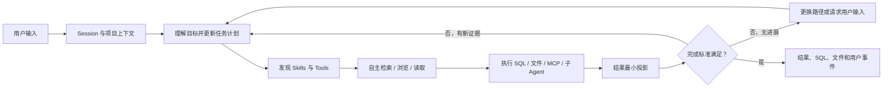

# Agent 与扩展运行时

## 1. 目的

本模块为 AI SQL 提供共用 Agent 能力：持续会话、项目上下文、计划与工作状态、自主工具使用、完成验证、Skills、MCP、子 Agent、文件产物、许可和可见轨迹。

运行时只有一个自适应 Agent 循环。ReAct 是每轮“行动—观察—调整”的基础思路，结构化 Plan 只保存当前目标、步骤和进度；SQL 结果、文件产物与批准等证据由 Runtime 根据真实工具结果独立记录和验证。两者不是面向用户的可选策略。

## 2. 子模块

| 子模块                 | 作用                                                    | 工程文档                                                                               |
| ---------------------- | ------------------------------------------------------- | -------------------------------------------------------------------------------------- |
| Session、项目与上下文  | 隔离会话，绑定项目，持久化消息、计划、偏好和压缩点      | [01-session-project-context.md](01-session-project-context.md)                         |
| 自适应循环、计划与验证 | 自主探索、工作状态、无进展换路和完成门禁                | [02-adaptive-loop-planning-verification.md](02-adaptive-loop-planning-verification.md) |
| Tools、结果与产物      | 通用/数据库工具、动态发现、调度、最小结果投影和文件产物 | [03-tools-results-artifacts.md](03-tools-results-artifacts.md)                         |
| Skills、MCP 与子 Agent | 标准 Markdown Skills、官方 MCP Client 和独立子上下文    | [04-skills-mcp-subagents.md](04-skills-mcp-subagents.md)                               |
| CLI 与用户体验         | 项目初始化、交互会话、扩展管理和用户事件                | [05-cli-user-experience.md](05-cli-user-experience.md)                                 |

## 3. 总流程

## 4. 对外效果

- `sessionId` 恢复一段独立完整会话。
- 打开项目目录后自动读取 `.schemanaut` 项目配置，不复制 Session 内容。
- 复杂任务产生可查看的工作计划，简单任务不增加多余步骤。
- 数据库计算留在数据库，模型只接收必要的小结果和错误。
- Agent 可以按需读取文件、写 SQL 脚本、调用 MCP 和委派子 Agent。
- CLI 与 REST 消费同一组用户事件、批准和产物合同；轻量 WebUI 当前只提供配置与基础 SQL 试用。

## 5. 工程边界

- `core-agent`：会话、计划、循环、上下文、子 Agent 与事件。
- `core-tools`：Tool Registry 适配、数据库/工作区/MCP 工具与结果投影。
- `core-skills`：Skill 标准、作用域、发现和加载。
- `sdk`：组合运行时并提供稳定调用入口。
- `apps/server`：REST、CLI 和轻量 WebUI。
- `tests`、`scripts`、`reports`：内部验收，不进入普通用户功能。
