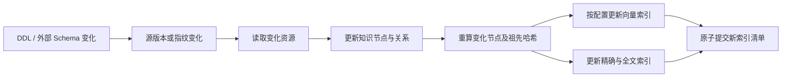

# 层级知识目录与检索

## 1. 目的

为 Agent 提供当前数据库的结构事实、关系和用户业务知识，并在大型数据库、集群和数仓场景下保持可检索、可增量更新、可验证和可隔离。

Schema RAG 不是普通文档分块。数据库连接、Schema、表、字段、索引、约束、函数和血缘本身已经具有稳定结构，应先规范化为资源节点，再生成检索投影。

## 2. 知识结构

### 2.1 主树

`contains` 关系形成唯一的包含树，层级不写死：

```text
连接知识空间
└─ 平台 / 集群 / 数据库
   └─ Schema
      ├─ 表 / 视图 / 外部表
      │  ├─ 字段
      │  ├─ 索引
      │  ├─ 约束
      │  └─ 触发器
      ├─ 函数
      └─ 存储过程
```

每个节点只保存直接子节点入口，不复制完整后代。父子类型来自公共 `ResourceKind`，未来增加 MySQL、ClickHouse 或数仓资源时不需要重写知识结构。

### 2.2 关系图

外键、依赖、血缘、运行位置和访问入口作为跨树关系保存。跨树关系不能参与递归子树哈希，否则有环关系会导致无限递归。

### 2.3 业务知识

业务知识按最合适的资源层级绑定：

- 数据库或 Schema：通用术语、时间口径、业务域说明。
- 表：用途、数据粒度、来源、更新周期。
- 字段：业务含义、单位、枚举、JSON 结构。
- Job 或 Pipeline：来源、上下游和生产方式。

知识正文按内容寻址保存；一个知识项可以绑定多个资源。绑定可选择仅当前节点或当前子树生效。知识保留来源、版本、更新时间和冲突状态。

Session 对话和临时查询结果不自动进入知识库。用户显式确认后，才可将结果提炼为新的业务知识。

## 3. 编码与稳定身份

每个节点包含：

```text
resourceId
connectionId
kind
parentId
canonicalName / displayName
ancestorIds
depth
localFacts
childIds
relationIds
knowledgeBindingIds
localHash
subtreeHash
```

`resourceId` 是身份主键；可读路径只是缓存和检索文本，不能作为唯一主键。Connector 能提供数据库原生 ID 时必须使用原生 ID 构造稳定资源 ID；只提供表名时允许使用兼容的合成 ID，重命名将被视为删除和新增。

哈希输入采用稳定字段顺序和规范 JSON 编码，不能依赖数据库返回顺序。

## 4. Merkle 版本

知识版本分为三层：

| 版本 | 用途 |
|---|---|
| `sourceRevision` | 判断知识是否跟上真实数据库 |
| `catalogRootHash` | 判断规范化知识内容是否一致 |
| `indexManifest` | 判断检索索引是否与知识版本和检索配置匹配 |

节点哈希：

```text
localHash = Hash(节点本地事实 + 本地知识绑定 + 本地关系记录)
subtreeHash = Hash(localHash + 排序后的直接子节点 ID 与 subtreeHash)
```

全局 Catalog 根还包含跨树关系根和业务知识对象根。Embedding 向量、继承后展开的知识、完整可读路径、查询热度和实时运行指标不进入知识内容哈希。

根哈希相同可以立即判定内容一致。根哈希不同时，从根开始只下沉到哈希不同的子节点。超宽节点使用固定大小的子节点哈希块，避免单个变化重新拼接数万个兄弟节点。

Merkle 只能证明本地内容完整一致，不能独立证明数据库没有外部变化。数据库事件、Connector cursor 或 Schema 指纹负责新鲜度判断。

## 5. 检索配置

生成模型、Embedding、Reranker 和本地检索后端彼此独立：

```text
GenerationProfile
EmbeddingProfile（可选）
RerankProfile（可选）
RetrievalBackendProfile
```

向量索引绑定 `EmbeddingFingerprint`：

```text
providerInstanceId
modelId
modelRevision
dimensions
normalization
distanceMetric
requestTemplateVersion
```

Fingerprint 变化时只重建向量索引。没有 Embedding 能力时，系统自动使用精确匹配、BM25、词典和图扩展，不中断数据库使用。

默认本地实现使用内存精确检索和 BM25，不引入原生模块。数据量扩大后，可通过适配器接入 Orama、Qdrant、OpenSearch 等后端，第三方类型不能进入公共合同。

## 6. 检索流程

1. 解析显式的 Schema、表和字段引用。
2. 在当前连接作用域内并行执行精确匹配、BM25、业务知识和可选向量召回。
3. 使用 RRF 融合不同通道，避免直接相加不可比较的分数。
4. 沿父子树、外键和血缘做有限跳数扩展。
5. 可选调用用户配置的 Reranker。
6. 按当前模型可用上下文空间限制检索结果大小。
7. Agent 可以继续调用资源浏览工具补充缺失信息。

检索始终带 `connectionId` 或运行时连接作用域。树结构本身不等于隔离；节点、关系、知识绑定和索引都必须进行作用域校验。

## 7. 更新流程



SchemaNaut 执行并提交的 DDL 直接触发增量更新；事务回滚不更新。外部工具执行的 DDL 在下次检索前由新鲜度检查发现。索引损坏时删除或隔离索引并回退到数据库访问，不能阻断数据库连接。

## 8. 工程路径

- 知识类型：[`packages/core-rag/src/types.ts`](../../packages/core-rag/src/types.ts)
- 目录构建：[`packages/core-rag/src/knowledge-catalog.ts`](../../packages/core-rag/src/knowledge-catalog.ts)
- Merkle：[`packages/core-rag/src/merkle-catalog.ts`](../../packages/core-rag/src/merkle-catalog.ts)
- 检索配置：[`packages/core-rag/src/retrieval-profile.ts`](../../packages/core-rag/src/retrieval-profile.ts)
- 检索器：[`packages/core-rag/src/hybrid-schema-retriever.ts`](../../packages/core-rag/src/hybrid-schema-retriever.ts)
- 持久化：[`packages/core-rag/src/schema-rag-snapshot-store.ts`](../../packages/core-rag/src/schema-rag-snapshot-store.ts)
