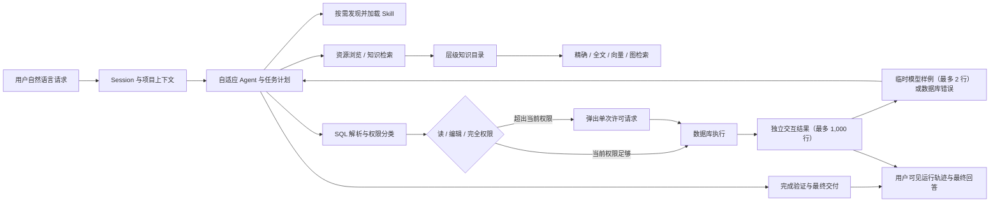

# AI SQL 生成与执行

## 1. 目的

AI SQL 模块将自然语言请求转化为可解释、可执行、可追踪的数据库操作。它不是一次性 Text-to-SQL 接口，而是由 Agent 根据任务逐步检索知识、浏览资源、探索数据、生成 SQL、请求批准、执行并根据反馈修正的完整运行流。

本模块复用公共大模型能力、数据库接入、统一资源模型和公共合同，不绑定某个模型厂商、Embedding 模型或检索后端。

## 2. 子模块

| 子模块                     | 功能                                                        | 工程文档                                                                       |
| -------------------------- | ----------------------------------------------------------- | ------------------------------------------------------------------------------ |
| 层级知识目录与检索         | 组织数据库结构、业务知识、关系、版本与检索索引              | [01-knowledge-catalog-and-retrieval.md](01-knowledge-catalog-and-retrieval.md) |
| Agent、Tools 与内置 Skills | 让模型按需浏览知识和调用数据库能力；共用运行时见 Agent 模块 | [02-agent-tools-and-skills.md](02-agent-tools-and-skills.md)                   |
| SQL 生成、权限与执行       | 解析 SQL、判断读/编辑/完全权限并执行反馈闭环                | [03-sql-generation-and-execution.md](03-sql-generation-and-execution.md)       |
| 功能、准确率与性能验收     | 规定中英文 Schema、复杂 SQL、真实数据库和真实模型测试       | [04-testing-and-performance.md](04-testing-and-performance.md)                 |

## 3. 主流程

Schema 新鲜度检查、权限分类、审批、事务、超时和 DDL 后刷新由运行时完成，不作为模型工具，也不依赖 Skill 提醒。

## 4. 服务方式

- TypeScript SDK：完整能力入口。
- REST API：复用 SDK 合同。
- CLI：启动、配置和诊断。
- WebUI：连接、模型、权限、知识和运行轨迹的轻量管理界面。

AI SQL 核心不依赖 IDE、工作区或复杂前端。

项目目录只用于 Agent 的文件、脚本和配置能力，不恢复 IDE 或数据库工作区概念。

## 5. 初始验收效果

| 指标                                              |         目标 |
| ------------------------------------------------- | -----------: |
| 明确表名、字段名精确命中率                        |         100% |
| 中英文混合问题的相关表召回率                      |        ≥ 98% |
| 相关字段召回率                                    |        ≥ 95% |
| 未经许可执行超出当前权限的 SQL                    |            0 |
| 每次运行的任务、工具、SQL、权限和产物内部可追踪率 |         100% |
| 单次执行超过两行的结果进入模型上下文              |            0 |
| Session 间消息、计划和结果交叉读取                |            0 |
| 10,000 个知识节点本地精确/全文检索 P95            |     ≤ 100 ms |
| 单分支 Merkle 差异定位 P95                        |      ≤ 20 ms |
| 简单任务输入 Token                                | 目标 ≤ 4,000 |
| 中等任务输入 Token                                | 目标 ≤ 8,000 |
| 达到模型窗口阈值后的自动压缩成功率                |         100% |
| 手动压缩后原始 Session 消息保留率                 |         100% |
| 10,000 条消息构建模型工作视图 P95                 |      ≤ 50 ms |

Token 用量和金额只做观测与计费，不作为默认上下文压缩条件。上下文压缩仅依据当前模型登记的物理窗口和输出预留空间触发。远程 Embedding、Reranker、模型推理、压缩推理和数据库执行延迟分别记录，不计入本地检索指标。

## 6. 核心代码入口

| 能力                     | 代码                                                                                                         |
| ------------------------ | ------------------------------------------------------------------------------------------------------------ |
| 知识目录构建             | [`packages/core-rag/src/knowledge-catalog.ts`](../../packages/core-rag/src/knowledge-catalog.ts)             |
| Merkle 快照与差异验证    | [`packages/core-rag/src/merkle-catalog.ts`](../../packages/core-rag/src/merkle-catalog.ts)                   |
| 检索配置与索引清单       | [`packages/core-rag/src/retrieval-profile.ts`](../../packages/core-rag/src/retrieval-profile.ts)             |
| 混合检索                 | [`packages/core-rag/src/hybrid-schema-retriever.ts`](../../packages/core-rag/src/hybrid-schema-retriever.ts) |
| RAG 运行时               | [`packages/core-rag/src/schema-rag-engine.ts`](../../packages/core-rag/src/schema-rag-engine.ts)             |
| Agent 运行循环           | [`packages/core-agent/src/react-agent.ts`](../../packages/core-agent/src/react-agent.ts)                     |
| 完成验证与最终交付       | [`packages/core-agent/src/completion-verifier.ts`](../../packages/core-agent/src/completion-verifier.ts)     |
| Tool 结果三层投影        | [`packages/core-agent/src/tool-result.ts`](../../packages/core-agent/src/tool-result.ts)                     |
| 上下文压缩与模型工作视图 | [`packages/core-agent/src/context-manager.ts`](../../packages/core-agent/src/context-manager.ts)             |
| Session 与压缩检查点存储 | [`packages/core-agent/src/session-store.ts`](../../packages/core-agent/src/session-store.ts)                 |
| AI SQL 内置工具          | [`packages/core-tools/src/ai-sql-tools.ts`](../../packages/core-tools/src/ai-sql-tools.ts)                   |
| 内置通用 Skills          | [`packages/core-skills/skills`](../../packages/core-skills/skills)                                           |
| SQL 解析与权限分类       | [`packages/core-db/src/sql-parser.ts`](../../packages/core-db/src/sql-parser.ts)                             |
| SDK 主入口               | [`packages/sdk/src/runtime.ts`](../../packages/sdk/src/runtime.ts)                                           |
| SQL Run 持久化           | [`packages/sdk/src/sql-run-store.ts`](../../packages/sdk/src/sql-run-store.ts)                               |
