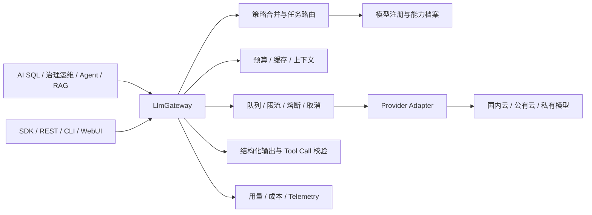
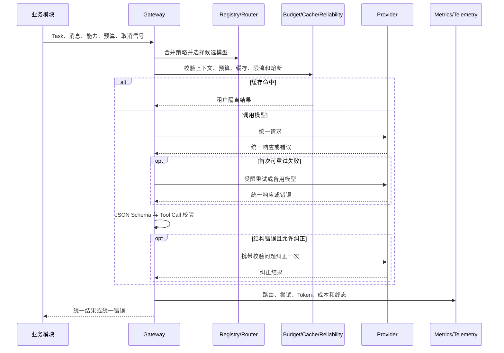

# SchemaNaut 公共基础能力：大模型能力

> 上级文档：[SchemaNaut 总体功能设计](../product-functional-overview.md)
>
> 文档性质：功能说明、工程架构与验收基线
> 实现状态：工程实现、零 Token 模型元数据发现与本地质量门已完成

## 1. 模块目的

大模型能力是 AI SQL、数据库治理运维、Agent 和 RAG 的统一模型基础设施。上层模块只描述任务、上下文、能力要求和预算，不直接依赖厂商 SDK 或协议。

本模块提供：

- 国内云、OpenAI-compatible、Anthropic 原生协议及本地私有模型的统一接入。
- 同步、流式、异步批量、Tool Calling、结构化输出、Embedding 和 Rerank 合同。
- 模型能力档案、策略路由、故障降级、预算、缓存和用量统计。
- 超时、取消、限流、排队、熔断、审计事件和脱敏。

本模块不决定 SQL 是否正确、工具是否获批、数据库操作是否执行，也不持久化明文 Secret。

## 2. 功能结构

```text
大模型能力
├─ 模型资源
│  ├─ Provider 与协议适配
│  ├─ Provider 预设
│  └─ 模型注册、能力档案与元数据发现
├─ 统一调用
│  ├─ 同步、流式与异步批量网关
│  ├─ Prompt、上下文与 Token 预算
│  └─ JSON Schema 与 Tool Call 校验
└─ 调度治理
   ├─ 分层策略、任务路由与故障降级
   ├─ 超时、取消、限流、队列与熔断
   ├─ 缓存、Token、成本与预算
   └─ 调用事件、指标与安全脱敏
```

### 2.1 Provider 与协议适配

**子模块设计**

- `OpenAICompatibleProvider` 适配 OpenAI-compatible 接口，覆盖国内云平台、Ollama、vLLM 和企业模型网关。
- `AnthropicProvider` 直接适配 Anthropic Messages 原生协议，不依赖 OpenAI 格式。
- Provider 统一返回消息、Tool Call、完成原因、用量和标准错误。
- Provider 声明能力；未知能力和不支持能力不得伪装为支持。
- 接入时只读取模型目录和模型元数据，不发送验证 Prompt，也不产生推理 Token。
- Ollama 使用 `/v1/models` 与 `/api/show`；其他 Provider 使用其模型目录、元数据接口或预设声明。

**达到的效果**

- 更换模型或部署方式时，上层业务合同不变。
- 私有 Endpoint 可以无 API Key 运行，公网 Endpoint 默认要求认证。
- 401、429、超时、取消、网络错误和上游错误具有统一语义，错误信息不回显密钥。

### 2.2 模型注册与能力档案

**子模块设计**

- 登记 Provider、模型、协议、部署方式、能力、上下文限制、并发和价格。
- 记录数据地域、数据保留、敏感数据能力和健康状态。
- 记录元数据来源、发现时间、模型家族、参数规模、量化方式和运行时健康状态。
- 内置 SiliconFlow、DeepSeek、智谱、Moonshot、Ollama、vLLM 配置预设；预设不包含密钥。

**达到的效果**

- 路由前即可判断模型是否满足任务要求。
- API 和 WebUI 可展示模型档案、元数据来源与运行时健康状态。
- Provider 未提供的能力记为 `unknown`，由路由谨慎处理；元数据声明不等于实际效果承诺。

### 2.3 统一调用网关

**子模块设计**

- `LlmGateway` 是新业务调用模型的唯一入口。
- 支持同步对话、流式事件、异步批量任务、Embedding 和 Rerank。
- 每次请求生成 `requestId` 与 `traceId`，并统一错误、用量、成本和路由结果。
- SDK、REST API、NL2SQL 和 Agent Runtime 入口全部经过 Gateway。
- 异步任务支持提交、进度查询、完成、失败和取消。

**达到的效果**

- 路由、预算、安全和观测策略只需实现一次。
- SDK、API、CLI 与 WebUI 看到一致的模型状态和错误。
- 业务代码中不再存在绕过 Gateway 的正式模型调用路径；确定性的 Provider 工程合同测试除外。

### 2.4 Prompt 与上下文管理

**子模块设计**

- Prompt 模板具备 ID、版本、必填变量、渲染和稳定指纹。
- 系统指令、业务上下文、用户输入和不可信内容明确分隔。
- 模型目录提供时，解析常见顶层或嵌套的上下文窗口、最大输出和能力字段；目录不完整时回退到注册表声明。
- 调用前估算 Token，并按发现到的模型物理上下文与输出限制执行保留、压缩或拒绝。
- 提供租户隔离的可选响应缓存，支持 TTL、命名空间和 LRU 淘汰。

**达到的效果**

- Prompt 可追踪、可复现，不以无版本字符串散落在业务代码中。
- 上下文超限不会静默进入 Provider；消费金额预算与物理上下文窗口是两套独立机制。
- 重复的确定性请求可减少 Token 和网络消耗，租户之间不能互相命中缓存。

### 2.5 结构化输出与 Tool Calling

**子模块设计**

- 使用 JSON Schema 校验 JSON Object、结构化响应和 Tool Call 参数。
- 支持移除标准 Markdown JSON 围栏后再校验，但不修造业务字段。
- 非法结构允许有限次数的纠正再生成，并计入尝试、Token 和成本。
- Gateway 默认拒绝未知工具和非法参数；Agent Runtime 入口由 Agent 权限管理器处理未授权工具。

**达到的效果**

- 非法结构不会作为成功业务结果返回。
- Provider 的 Tool Calling 差异不会泄漏到 Agent、MCP 或 Skills。
- Tool Call 通过格式校验后仍必须经过 Agent 授权与安全执行。

### 2.6 路由与策略

**子模块设计**

- 平台、组织和用户三层策略合并；用户只能增加限制，不能放宽硬约束。
- 按能力、上下文、输出长度、部署方式、地域、敏感数据、健康、质量和成本筛选。
- 支持固定 Provider/模型、偏好模型、候选模型和主备降级。
- 返回选中原因、候选顺序和每个排除项的原因。

**达到的效果**

- 敏感任务可强制留在国内或私有部署。
- 简单任务可选低成本模型，复杂诊断可要求更高质量或推理能力。
- 硬约束冲突时明确失败，不自动把数据发往更宽松的模型。

### 2.7 稳定性与流量控制

**子模块设计**

- 对 408、429、502、503、504 支持受限重试，遵守 `Retry-After`，使用带抖动和上限的指数退避；其他 4xx 不重试。
- 按 Provider 控制并发、排队长度、排队超时、请求速率和 Token 速率。
- 熔断器支持关闭、打开、半开探测和恢复。
- 流式调用分别限制首事件、首个可见文本和总完成时间，并在错误中标明超时阶段。
- 流式响应一旦产生可见输出，不再静默重试或切换模型拼接结果；取消与超时会中止底层 HTTP 请求。
- 失败与取消请求的已消耗用量仍进入统计。

**达到的效果**

- 单一模型故障不会拖垮调用服务。
- 重试和纠正次数有上限，不产生无限 Token 消耗。
- 取消可以传递到 Provider、排队、退避和异步任务。

### 2.8 Token、成本、预算与观测

**子模块设计**

- Provider 返回用量时记录实际值；未返回时生成估算值并标记 `estimated`，不得记为零。
- 根据模型价格计算调用成本，支持单请求和租户/用户/任务范围的预算预留与结算。
- 预算按最坏情况下的重试、降级和结构纠正次数预留。
- 产生请求、路由、缓存、预算、尝试、重试、降级、熔断、完成、失败和取消事件。
- 指标包含请求量、成功/失败/取消、缓存、重试、降级、Token、成本、P50/P95/P99 和分模型统计。

**达到的效果**

- 用户可解释每次 AI 消耗发生在哪里。
- 已知预算不足的请求在调用 Provider 前被拒绝。
- 事件只记录元数据与脱敏属性，不记录明文 Secret 或默认保存完整 Prompt。

## 3. 工程架构



### 3.1 单次调用流程



## 4. 公共工程合同

| 合同                         | 作用                                     | 代码                                                                 |
| ---------------------------- | ---------------------------------------- | -------------------------------------------------------------------- |
| `LlmProvider`                | Provider 必须实现的统一能力              | [`types.ts`](../../packages/core-llm/src/types.ts)                   |
| `LlmChatRequest/Response`    | 消息、工具、结构化输出、推理、用量与取消 | [`types.ts`](../../packages/core-llm/src/types.ts)                   |
| `LlmModelProfile`            | 能力、限制、价格、数据策略和健康         | [`model-registry.ts`](../../packages/core-llm/src/model-registry.ts) |
| `LlmTaskProfile`             | 任务硬要求和偏好                         | [`routing.ts`](../../packages/core-llm/src/routing.ts)               |
| `LlmGatewayChatInput/Result` | Gateway 输入、路由结果、尝试与成本       | [`llm-gateway.ts`](../../packages/core-llm/src/llm-gateway.ts)       |
| `LlmAsyncJob`                | 异步任务状态、进度、结果和取消           | [`async-jobs.ts`](../../packages/core-llm/src/async-jobs.ts)         |
| `LlmTelemetryEvent`          | 调用链事件与可观测字段                   | [`telemetry.ts`](../../packages/core-llm/src/telemetry.ts)           |

模型内部思维过程不是公共合同。平台只传递厂商允许公开的文本、工具结果、完成原因和用量。

## 5. 组件与代码路径

| 组件               | 职责                                          | 源码                                                                                                                                                                       | 主要测试                                                                                                |
| ------------------ | --------------------------------------------- | -------------------------------------------------------------------------------------------------------------------------------------------------------------------------- | ------------------------------------------------------------------------------------------------------- |
| 公共合同           | 消息、流、工具、Embedding、Rerank、能力和错误 | [`types.ts`](../../packages/core-llm/src/types.ts)                                                                                                                         | [`openai-compatible-provider.test.ts`](../../packages/core-llm/test/openai-compatible-provider.test.ts) |
| 统一网关           | 同步/流式/批量、路由、预算、可靠性、用量      | [`llm-gateway.ts`](../../packages/core-llm/src/llm-gateway.ts)                                                                                                             | [`llm-gateway.test.ts`](../../packages/core-llm/test/llm-gateway.test.ts)                               |
| 模型注册           | Provider、模型、能力、限制、数据策略和健康    | [`model-registry.ts`](../../packages/core-llm/src/model-registry.ts)                                                                                                       | [`model-routing.test.ts`](../../packages/core-llm/test/model-routing.test.ts)                           |
| 路由策略           | 分层约束、偏好、候选和成本计算                | [`routing.ts`](../../packages/core-llm/src/routing.ts)                                                                                                                     | [`model-routing.test.ts`](../../packages/core-llm/test/model-routing.test.ts)                           |
| OpenAI-compatible  | 国内云、本地和私有兼容协议                    | [`openai-compatible-provider.ts`](../../packages/core-llm/src/openai-compatible-provider.ts)                                                                               | [`provider-adapters.test.ts`](../../packages/core-llm/test/provider-adapters.test.ts)                   |
| Anthropic 原生协议 | Messages、Tool Use 和流事件转换               | [`anthropic-provider.ts`](../../packages/core-llm/src/anthropic-provider.ts)                                                                                               | [`provider-adapters.test.ts`](../../packages/core-llm/test/provider-adapters.test.ts)                   |
| Provider 预设      | 国内云、Ollama 和 vLLM 配置模板               | [`provider-presets.ts`](../../packages/core-llm/src/provider-presets.ts)                                                                                                   | [`provider-adapters.test.ts`](../../packages/core-llm/test/provider-adapters.test.ts)                   |
| 模型元数据发现     | 读取模型目录、能力、上下文和模型信息          | [`openai-compatible-provider.ts`](../../packages/core-llm/src/openai-compatible-provider.ts)、[`anthropic-provider.ts`](../../packages/core-llm/src/anthropic-provider.ts) | [`provider-adapters.test.ts`](../../packages/core-llm/test/provider-adapters.test.ts)                   |
| Prompt 与上下文    | 模板、指纹、Token 估算、裁剪和不可信内容隔离  | [`prompt-runtime.ts`](../../packages/core-llm/src/prompt-runtime.ts)                                                                                                       | [`prompt-structured.test.ts`](../../packages/core-llm/test/prompt-structured.test.ts)                   |
| 结构化校验         | JSON Schema 与 Tool Call 参数校验             | [`structured-output.ts`](../../packages/core-llm/src/structured-output.ts)                                                                                                 | [`prompt-structured.test.ts`](../../packages/core-llm/test/prompt-structured.test.ts)                   |
| 稳定性             | 并发、队列、速率、取消和熔断                  | [`reliability.ts`](../../packages/core-llm/src/reliability.ts)                                                                                                             | [`reliability-budget.test.ts`](../../packages/core-llm/test/reliability-budget.test.ts)                 |
| Provider 重试策略  | 状态分类、Retry-After、指数退避与流阶段超时   | [`retry-policy.ts`](../../packages/core-llm/src/retry-policy.ts)                                                                                                           | [`retry-policy.test.ts`](../../packages/core-llm/test/retry-policy.test.ts)                             |
| 预算               | 预留、范围配额、实际结算和拒绝                | [`budget.ts`](../../packages/core-llm/src/budget.ts)                                                                                                                       | [`reliability-budget.test.ts`](../../packages/core-llm/test/reliability-budget.test.ts)                 |
| 响应缓存           | 租户隔离、TTL、命名空间和 LRU                 | [`response-cache.ts`](../../packages/core-llm/src/response-cache.ts)                                                                                                       | [`llm-gateway.test.ts`](../../packages/core-llm/test/llm-gateway.test.ts)                               |
| 异步任务           | 批量并发、进度、终态和取消                    | [`async-jobs.ts`](../../packages/core-llm/src/async-jobs.ts)                                                                                                               | [`llm-entrypoints.test.ts`](../../apps/server/test/llm-entrypoints.test.ts)                              |
| 观测               | 脱敏事件、指标和分模型统计                    | [`telemetry.ts`](../../packages/core-llm/src/telemetry.ts)                                                                                                                 | [`llm-security.test.ts`](../../packages/core-llm/test/security/llm-security.test.ts)                    |
| Agent Runtime 门面 | Agent 模型调用统一经过 Gateway                | [`llm-router.ts`](../../packages/core-llm/src/llm-router.ts)                                                                                                               | [`llm-router.test.ts`](../../packages/core-llm/test/llm-router.test.ts)                                 |
| SDK 入口           | 模型配置、元数据发现、对话、流、任务和指标    | [`runtime.ts`](../../packages/sdk/src/runtime.ts)                                                                                                                          | [`runtime.test.ts`](../../packages/sdk/test/runtime.test.ts)                                            |
| REST 与 WebUI      | 模型 API、SSE、任务和管理界面                 | [`server.ts`](../../apps/server/src/server.ts)、[`web-ui.ts`](../../apps/server/src/web-ui.ts)                                                                             | [`server.test.ts`](../../apps/server/test/server.test.ts)                                               |

## 6. 使用方式

### 6.1 SDK

```ts
import { DatabaseAgentRuntime, OpenAICompatibleProvider } from '@nwlworkshop/schemanaut';

const runtime = new DatabaseAgentRuntime({
  tenantId: 'team-a',
  provider: new OpenAICompatibleProvider({
    id: 'siliconflow',
    name: 'SiliconFlow',
    baseUrl: 'https://api.siliconflow.cn/v1',
    apiKey: process.env.SILICONFLOW_API_KEY,
  }),
  model: 'YOUR_MODEL',
});

const response = await runtime.llmChat(
  { messages: [{ role: 'user', content: '解释这条慢 SQL 的主要风险' }] },
  { taskType: 'database-diagnosis', timeoutMs: 30_000, maxRetries: 1 },
);
```

本地 Ollama/vLLM 可使用 `allowUnauthenticated: true`，但只应配置可信的内网或回环地址。

### 6.2 REST API

| 方法与路径                     | 用途                               |
| ------------------------------ | ---------------------------------- |
| `GET /v1/llm/provider-presets` | 获取无密钥 Provider 预设           |
| `POST /v1/llm/setup`           | 配置当前模型并读取模型目录与元数据 |
| `GET /v1/llm/models`           | 查看模型与健康档案                 |
| `GET /v1/llm/metrics`          | 查看 Token、成本、延迟和错误指标   |
| `POST /v1/llm/chat`            | 同步对话                           |
| `POST /v1/llm/chat/stream`     | SSE 流式对话                       |
| `POST /v1/llm/jobs`            | 提交异步批量任务                   |
| `GET /v1/llm/jobs/:id`         | 查询任务                           |
| `DELETE /v1/llm/jobs/:id`      | 取消任务                           |

WebUI 的“模型管理”区域使用同一组 API，只负责配置、模型档案和指标查看，不提供主动验证入口。

## 7. 测试与实测指标

### 7.1 自动化质量门

| 验证项                                      | 当前候选门禁                                                                                                    |
| ------------------------------------------- | --------------------------------------------------------------------------------------------------------------- |
| `core-llm`、Provider、SDK/API 与 Agent 入口 | 纳入全仓确定性回归并通过                                                                                        |
| 全仓构建、TypeScript、ESLint 与差异格式     | 通过                                                                                                            |
| 全仓确定性回归                              | 通过；精确的文件数、用例数与跳过数见[上线前审计矩阵](../../reports/pre-release-audit/00-traceability-matrix.md) |
| 真实 PostgreSQL                             | 独立门禁通过；其中需要真实 LLM 的用例明确跳过                                                                   |
| 真实 LLM                                    | 本次未获外部 Token 消耗授权，未执行且不计为通过                                                                 |

测试范围包括 Provider 合同、元数据解析、路由、结构化输出、预算、缓存、租户隔离、Secret 脱敏、故障注入、熔断、取消、SDK/API/Agent 入口和异步任务。工程测试使用确定性 Provider 或模拟元数据响应，不调用用户模型。

用例数量会随回归测试增加而变化，本功能文档不复制历史计数。本次候选版本的精确测试统计、源码状态和外部证据缺口统一由上线前审计矩阵记录。

### 7.2 平台性能

基准使用 1,000 个有效样本、并发 50 和进程内确定性 Provider，只测 SchemaNaut 平台开销，不包含外部模型、网络和排队时间。

| 指标                               | 验收阈值 |
| ---------------------------------- | -------: |
| 路由决策 P95                       |  ≤ 20 ms |
| 约 8KB 中英混合文本 Token 估算 P95 |   ≤ 5 ms |
| JSON Schema 结构校验 P95           |   ≤ 5 ms |
| Gateway 调用路径 P95               |  ≤ 50 ms |
| 流事件转发 P95                     |  ≤ 50 ms |
| 异步任务提交 P95                   |  ≤ 50 ms |
| 取消传播 P95                       | ≤ 100 ms |

[性能报告](../../reports/llm-platform/performance.json)是实测值的唯一事实来源，包含 `generatedAt`、运行环境、样本规模、P50/P95/P99、阈值和逐项结论；文档不复制会随机器与候选源码变化的历史数值。报告中的 `gatewayMetrics.latencyMs` 还包含批量任务在并发控制下的端到端平台停留时间；用于门禁的单次 Gateway 处理路径是 `gatewayTotalMs`。

### 7.3 零 Token 模型元数据发现

模型接入只执行模型目录与元数据查询，不构造业务 Prompt，不调用生成接口。能力档案按以下顺序构建：

1. Provider 模型目录与模型详情接口。
2. Provider 明确返回的能力、上下文和模型属性。
3. SchemaNaut Provider 预设中的协议级声明。
4. 无来源的能力保持 `unknown`，不通过实际调用补测。

本地 Ollama 的 `qwen2.5-coder:14b` 元数据读取结果包含 `tools`、32,768 上下文、`qwen2` 家族、14.8B 参数量和 `Q4_K_M` 量化信息；因此档案把 Tool Calling 记录为 Provider 声明支持。这个结果只表达元数据声明，不承诺模型在所有提示下都能正确调用工具。

### 7.4 历史 opt-in 真实 Endpoint 记录（非本次候选门禁）

真实 Endpoint 只用于显式启动的工程测试，不接入 SDK、REST API 或 WebUI 的产品功能，也不在默认 CI 中运行。以下内容来自已有的 opt-in 归档；它们没有在 2026-07-26 本次候选源码上重新执行，因此不能作为本次发布门禁的通过证据。

- 既有功能归档记录过硅基流动 `deepseek-ai/DeepSeek-V4-Pro` 的 Schema 索引、RAG 上下文构建、NL2SQL、安全检查、批准后 PostgreSQL 执行和数据库只读阻断链路。
- [`live-performance.json`](../../reports/llm-platform/live-performance.json) 的 `generatedAt` 为 2026-07-23；其中 3 个同步请求 P50 4.07 秒、P95 69.92 秒，共 2,314 Token。
- 同一历史报告记录的流式请求首 Token 为 93.41 秒、总耗时 93.48 秒，共 3,460 Token。
- 这些小样本只说明当时环境中的调用与计量链路，不代表当前候选、供应商 SLA 或并发容量。

本次候选的最终审计明确记录“真实 LLM 未获付费 Token 授权，未执行”；获得授权后必须针对待发布的同一源码状态重新运行，才能形成发布证据。

## 8. 测试入口

```bash
pnpm test:llm-platform
pnpm test:llm-platform:contracts
pnpm test:llm-platform:entrypoints
pnpm test:llm-platform:faults
pnpm test:llm-platform:security
pnpm test:llm-platform:performance
pnpm test:functional:live
pnpm test:performance:live
pnpm typecheck
pnpm lint
pnpm test
```

前六个分层与平台测试不访问真实模型。`test:functional:live` 和 `test:performance:live` 会显式读取本地 `.env` 中的硅基流动凭据并产生费用；前者还会重建专用的 `dbagent_core_db_test` 数据库。本次候选未执行这两项付费门禁。

关键测试代码：

- Provider 合同：[`provider-contract-suite.ts`](../../packages/core-llm/test/contracts/provider-contract-suite.ts)
- Provider 模型目录与元数据：[`provider-adapters.test.ts`](../../packages/core-llm/test/provider-adapters.test.ts)
- 产品入口：[`llm-entrypoints.test.ts`](../../apps/server/test/llm-entrypoints.test.ts)
- 故障注入：[`llm-fault-injection.test.ts`](../../packages/core-llm/test/fault-injection/llm-fault-injection.test.ts)
- 安全边界：[`llm-security.test.ts`](../../packages/core-llm/test/security/llm-security.test.ts)
- 性能基准：[`run-llm-platform-benchmark.mjs`](../../scripts/run-llm-platform-benchmark.mjs)
- 真实功能：[`postgres.integration.test.ts`](../../packages/sdk/test/postgres.integration.test.ts)
- 真实 API 性能：[`run-llm-live-performance.mjs`](../../scripts/run-llm-live-performance.mjs)

## 9. 依赖与安全说明

结构化输出使用 `ajv@8.20.0`：MIT 许可、纯 JavaScript/TypeScript、无原生二进制和运行时下载。手写 JSON Schema 校验会遗漏组合关键字、错误路径和方言行为，因此不采用；Ajv 被封装在模型结构校验层，其对象模型不进入公共合同。发行说明列出直接运行时依赖，传递依赖的许可证文件由各 npm 包随安装树提供。

安全边界：

- 默认不在 Telemetry 中保存完整 Prompt、响应或 Secret。
- API Key 仅进入 Provider 请求头，不进入模型档案、状态接口和报告。
- 缓存键包含租户，跨租户缓存命中被测试禁止。
- 公网 Provider 默认必须认证；无认证模式只用于用户明确配置的本地/私有 Endpoint。
- Tool Call 的结构合法不代表获得执行权限，执行仍由 Agent、MCP、Skills 与 SQL 安全模块决定。

## 10. 实际场景

**AI SQL 准确性优先**：AI SQL 要求结构化输出、长上下文和私有部署。路由只保留满足要求的模型，Gateway 校验返回结构并记录 Token；SQL 正确性与执行审批仍由 AI SQL 和安全执行模块负责。

**低成本周期治理**：规则系统只在异常或周期到期时请求 AI 摘要，并设置预算和低成本偏好。Gateway 优先使用缓存或低成本模型，预算不足时在调用前拒绝。

**生产故障诊断**：私有主模型在首次输出前超时，Gateway 按硬约束切换到允许的国内备用模型并记录原因；若流式输出已经开始，则明确中断，不拼接另一模型的结果。
