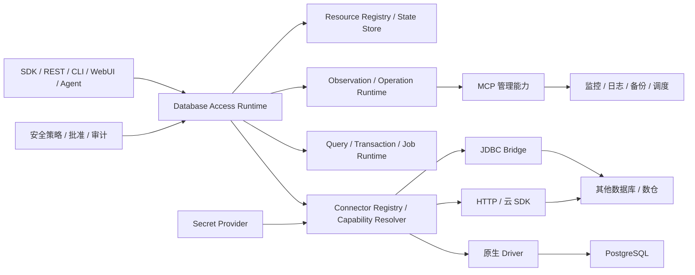
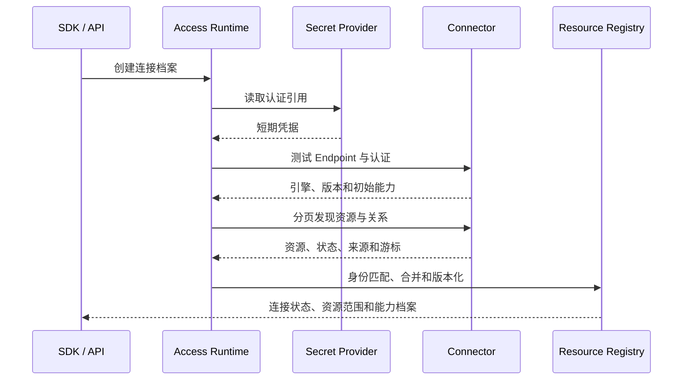
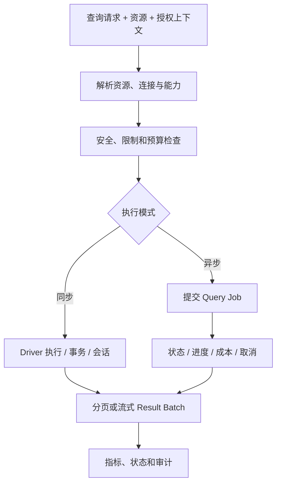

# SchemaNaut 公共基础能力：数据库接入与能力描述

> 上级文档：[SchemaNaut 总体功能设计](../product-functional-overview.md)
>
> 文档性质：功能说明、工程架构与开发验收基线
>
> 关联文档：[统一资源与状态模型](03-unified-resource-state.md)、[公共类型与合同](04-public-types-and-contracts.md)
> 当前状态：已完成；PostgreSQL 为真实参考实现，数仓与集群已通过架构合同级 Mock，尚未进行具体厂商兼容认证

## 1. 模块目的

本模块通过 Connector 把不同数据库、数仓、集群及其管理入口转换为统一的数据库能力和执行合同，并把发现结果提交给独立的统一资源运行时，为 AI SQL、RAG、治理运维、Agent、MCP 和 Skills 提供确定性数据库底座。

PostgreSQL 是首个真实参考实现，但公共合同不能以单机 PostgreSQL 的 `host + port + database` 为边界。系统从一开始就必须容纳：

- 单实例、主从、分片和高可用集群。
- 计算存储分离、异步查询和按扫描量计费的数仓。
- 原生 Driver、JDBC、HTTP/云 SDK 和 MCP 管理入口。
- 同一物理资源由多个连接和多个来源共同发现。

本模块只提供数据库事实和原子能力，不做 AI 推断，不决定高风险动作是否获批，不保存明文 Secret，也不实现跨数据源联邦查询引擎。

## 2. 功能结构

```text
数据库接入与能力描述
├─ 数据源接入
│  ├─ 连接档案与生命周期
│  ├─ Connector、Driver 与方言
│  └─ 动态能力描述与协商
├─ 数据库能力
│  ├─ 元数据与资源发现
│  ├─ SQL、事务与会话执行
│  ├─ 数仓异步任务与大结果集
│  └─ 集群拓扑、状态与运维原子能力
└─ 运行保障
   ├─ 超时、取消、重连与错误
   ├─ 权限事实、审计与脱敏
   └─ Connector 合同测试与兼容认证
```

资源身份、关系、状态、来源、冲突、历史和查询由[统一资源与状态模型](03-unified-resource-state.md)统一定义。本模块只负责将数据库事实转换为该合同。

### 2.1 连接档案与生命周期

**子模块设计**

- 连接档案由 Connector 类型、Endpoint、认证引用、网络设置、默认资源范围、会话参数和用途组成。
- 支持 TCP、JDBC、HTTP/云 SDK、SSL、SSH Tunnel、代理、Private Link、证书和临时令牌等形态。
- 区分查询、只读、读写、管理和监控入口。
- 提供创建、测试、连接、连接池、重连、健康、关闭和凭据轮换后的重建能力。
- Secret 仅通过引用进入连接过程，不进入资源、状态、错误、日志或普通 API 响应。

**达到的效果**

- 新数据源不需要强行映射为 PostgreSQL 的连接参数。
- 远程高延迟、临时凭据和多入口环境可以正常运行。
- 连接断开或凭据变化时状态明确，不留下失效连接继续执行。

### 2.2 Connector、Driver、方言与动态能力

**子模块设计**

- Connector 统一承载原生 Driver、JDBC Bridge、HTTP/云 SDK 和管理适配器；SQL Driver 只是其中一种。
- 方言描述标识符、参数、分页、时间、JSON、数组、DDL、系统表和错误语义。
- 能力状态使用 `supported`、`conditional`、`unsupported` 和 `unknown`，并携带限制、原因和来源。
- 实际能力由 Connector 静态声明、引擎版本、资源角色、连接用途和当前账号权限共同确定。
- 能力覆盖查询、事务、异步任务、取消、EXPLAIN、元数据、权限、状态、运维动作、结果传输和配额。

**达到的效果**

- 上层在调用前就能知道能力是否满足要求。
- “引擎支持但当前连接不允许”不会被误判为可执行。
- 新 Driver 只需实现统一合同，不需要修改 AI SQL 和 Agent 主流程。

### 2.3 元数据与资源发现

**子模块设计**

- 发现 Catalog、Database、Schema、表、视图、物化视图、外部表、字段、分区、索引、约束、函数、过程、触发器、序列、角色和权限。
- 保留注释、类型、所有者、依赖、估算规模、定义及数据源原始属性。
- 支持分页、批量、限速、断点、增量刷新和大型 Catalog 的资源上限。
- 输出标准资源和关系，不直接构建 RAG、业务术语或治理结论。

**达到的效果**

- RAG、治理和运维共享同一份可追溯数据库事实。
- 元数据规模扩大时仍能渐进发现和更新。
- 不支持的对象类型明确标记，不因缺失接口而返回空成功。

### 2.4 SQL、事务与会话执行

**子模块设计**

- 支持参数化 SQL、同步执行、分页、游标、流式结果、多结果集、超时、取消和结果限制。
- 单次查询超时在 PostgreSQL 服务端执行，并受连接档案总上限约束；超时返回 `QUERY_TIMEOUT`，主动取消返回 `QUERY_CANCELLED`，两者不混用。
- 提供事务、提交、回滚、Savepoint、隔离级别和失败事务恢复；不支持事务的数据源明确声明。
- 需要事务、临时表或会话参数的任务使用粘性会话，不能在连接池中随意切换连接。
- 标准化 Decimal、时间与时区、JSON、数组、二进制和厂商扩展类型，同时保留原始类型信息。
- Driver 只执行已经通过安全模块校验并携带授权上下文的动作；读取仍受超时、扫描量、结果规模和敏感数据限制。

**达到的效果**

- 同一执行合同覆盖普通查询和复杂事务，同时保留不同引擎语义。
- 大结果不会一次性全部进入内存。
- 取消、失败和网络中断后可以说明数据库是否可能发生变化。

### 2.5 数仓异步任务与大结果集

**子模块设计**

- 使用统一 Query Job 表达提交、排队、运行、阶段进度、完成、失败、取消和结果过期。
- 记录供应商查询 ID、执行资源、扫描字节、资源消耗、费用、优先级和结果保留时间。
- 支持轮询、事件回调、分页、流式批次、Arrow/Parquet 或受控下载地址。
- 支持 Dry Run、扫描上限和最大费用等数仓专用保护能力。

**达到的效果**

- 数仓不需要伪装成同步数据库连接。
- 长任务可以查询状态、取消和恢复结果读取。
- 用户可以在执行前后看到扫描量和成本事实。

### 2.6 集群拓扑与分布式状态

**子模块设计**

- 表达主节点、副本、Shard、协调节点、计算组、存储组、可用区和复制关系。
- 区分集群、节点、Database 和查询任务的状态及操作范围。
- 记录 Leader 切换、复制延迟、一致性级别、路由入口、局部故障和降级状态。
- 同一集群部分节点不可用时返回局部状态，不把整个集群简单记为正常或失败。

**达到的效果**

- Agent 清楚操作对象是集群、节点还是逻辑数据库。
- 集群扩容、故障转移和副本异常可以进入统一状态模型。
- 单节点故障不会抹去其他节点和集群层级的有效状态。

### 2.7 状态采集与运维原子能力

**子模块设计**

- 采集会话、活动 SQL、慢查询、锁、事务、连接、容量、索引、配置、复制、备份和任务状态。
- 提供取消查询、终止会话、统计信息更新、维护任务等边界明确的原子操作描述。
- SQL 可获得的能力优先由 Driver 提供；云控制面、监控、日志、备份和调度能力可由管理适配器或 MCP 提供。
- 本模块只返回事实和执行结果，诊断、治理策略和自动化流程属于上层。

**达到的效果**

- 确定性采集不依赖大模型。
- Driver 与 MCP 的能力可以映射到同一资源和审计上下文。
- Agent 不直接获得无边界的数据库管理接口。

### 2.8 可靠性、错误与审计

**子模块设计**

- 统一认证、网络、权限、语法、事务、锁、超时、取消、配额和供应商错误。
- 错误保留原始代码、阶段、作用资源、是否可重试和恢复建议，但不返回 Secret。
- 只读、幂等和状态查询允许按策略重试；写入、DDL 和管理动作不得因网络错误盲目重放。
- 所有查询和动作记录资源、连接、账号、权限上下文、批准来源、耗时、结果规模和终态。
- Connector 运行时故障与主进程隔离，第三方 JDBC 或本地依赖不能拖垮核心服务。

**达到的效果**

- 上层获得一致且可操作的错误语义。
- 无法确认写入结果时明确返回“不确定”，而不是自动重试或宣称失败。
- 每次数据库访问都能追溯到资源、连接、调用方和授权依据。

### 2.9 Connector 合同测试与兼容认证

**子模块设计**

- 所有 Connector 必须通过统一合同测试，覆盖能力声明、资源发现、执行、取消、错误和状态转换。
- PostgreSQL 使用真实数据库验证数据库语义；数仓和集群先使用合同级 Mock 验证架构。
- 记录 Connector、Driver、引擎和协议版本及已验证范围。
- Mock 通过只表示公共合同能够容纳该场景，不表示已支持某个真实厂商。

**达到的效果**

- 新增数据库不会破坏既有公共行为。
- 不受支持和未测试能力不会出现在“已支持”列表中。
- 未来获得真实数仓或集群环境后，可以复用同一合同套件完成认证。

## 3. 动态能力模型

能力状态：

| 状态 | 含义 |
|---|---|
| `supported` | 当前资源和凭据可以直接使用 |
| `conditional` | 满足限制或获得额外批准后可使用 |
| `unsupported` | 已确认当前环境不支持 |
| `unknown` | 没有可靠信息，不推断为支持 |

能力解析顺序：

```text
Connector 静态能力
→ 引擎与版本能力
→ 资源角色和运行状态
→ 连接用途和网络条件
→ 当前账号有效权限
→ SchemaNaut 安全策略与批准
```

主要能力域：

| 能力域 | 代表能力 |
|---|---|
| 连接 | 池化、重连、临时凭据、多 Endpoint |
| SQL | 查询、参数化、写入、DDL、多语句 |
| 事务 | 提交、回滚、Savepoint、隔离级别 |
| 查询任务 | 同步、异步、进度、取消、结果恢复 |
| 性能 | EXPLAIN、ANALYZE、Dry Run、成本与扫描量 |
| 元数据 | Catalog、Schema、对象、权限、依赖、增量 |
| 运维 | 会话、锁、配置、复制、备份、维护动作 |
| 结果 | 分页、游标、流式、列式批次、下载 |
| 限制 | 并发、超时、最大 SQL、结果、扫描和费用 |

## 4. 工程架构



工程归属：

- 公共资源、连接、能力和查询合同归属 [`packages/shared/src`](../../packages/shared/src/)。
- Driver、资源发现、执行和状态采集归属 [`packages/core-db/src`](../../packages/core-db/src/)。
- SDK 编排归属 [`packages/sdk/src`](../../packages/sdk/src/)。
- REST 与轻量管理界面归属 [`apps/server/src`](../../apps/server/src/)。
- 权限批准、MCP 与 Skills 继续使用各自模块，本模块只提供接入点。

## 5. 关键流程

### 5.1 数据源接入与资源发现



### 5.2 同步数据库与异步数仓执行



## 6. 公共合同与代码路径

### 6.1 目标公共合同

| 合同 | 作用 | 目标归属 | 当前状态 |
|---|---|---|---|
| `ResourceDescriptor/Relation` | 资源身份、类型和关系 | [`resource.ts`](../../packages/shared/src/contracts/resource.ts) | 已完成 |
| `ResourceObservation/Snapshot` | 状态来源、时间、有效期和版本 | [`resource.ts`](../../packages/shared/src/contracts/resource.ts) | 已完成 |
| `ConnectionProfile/Endpoint` | 多形态连接与认证引用 | [`database.ts`](../../packages/shared/src/contracts/database.ts) | 已完成 |
| `CapabilityProfile` | 动态能力、限制、原因和来源 | [`database.ts`](../../packages/shared/src/contracts/database.ts) | 已完成 |
| `DatabaseConnector` | 连接、发现、执行、状态和动作入口 | [`connector.ts`](../../packages/core-db/src/connector.ts) | 已完成 |
| `ResourceDiscoveryPage/ChangeSet` | 分页与增量资源发现 | [`resource.ts`](../../packages/shared/src/contracts/resource.ts) | 已完成 |
| `QuerySubmission/QueryJob` | 同步和异步查询生命周期 | [`database.ts`](../../packages/shared/src/contracts/database.ts) | 已完成 |
| `ResultBatch/ResultHandle` | 分页、流式和外部结果 | [`database.ts`](../../packages/shared/src/contracts/database.ts) | 已完成 |
| `DatabaseOperation` | 边界明确的状态采集和原子动作 | [`database.ts`](../../packages/shared/src/contracts/database.ts) | 已完成 |
| `DatabaseAccessError` | 跨数据源错误和恢复语义 | [`database.ts`](../../packages/shared/src/contracts/database.ts) | 已完成 |

### 6.2 工程实现

| 组件 | 当前能力 | 源码 | 测试 |
|---|---|---|---|
| 公共合同 | 资源、连接、能力、任务、结果、观测、操作、错误和审计 | [`contracts`](../../packages/shared/src/contracts/) | [`packages/shared/test`](../../packages/shared/test/) |
| 资源注册表 | 稳定身份、索引、关系图、来源合并、增量变更、人工绑定和快照 | [`resource-registry.ts`](../../packages/core-resource/src/resource-registry.ts) | [`packages/core-resource/test`](../../packages/core-resource/test/) |
| 能力解析 | 四态能力、分层覆盖、限制条件与明确拒绝 | [`capability-resolver.ts`](../../packages/core-db/src/capability-resolver.ts) | [`capability-resolver.test.ts`](../../packages/core-db/test/capability-resolver.test.ts) |
| Connector 注册与合同认证 | 注册、查找、Manifest 校验及可复用只读合同验证 | [`connector-registry.ts`](../../packages/core-db/src/connector-registry.ts)、[`connector-contract-verifier.ts`](../../packages/core-db/src/connector-contract-verifier.ts) | [`connector-registry.test.ts`](../../packages/core-db/test/connector-registry.test.ts)、[`connector-scenarios.test.ts`](../../packages/core-db/test/connector-scenarios.test.ts) |
| Database Access Runtime | 档案、Secret 解析、生命周期、发现、任务、事务、观测、操作、审计和指标 | [`database-access-runtime.ts`](../../packages/core-db/src/database-access-runtime.ts) | [`database-access-runtime.test.ts`](../../packages/core-db/test/database-access-runtime.test.ts) |
| PostgreSQL Connector | 多 Endpoint、完整 Catalog、同步/异步任务、分页结果、粘性事务、状态采集和维护动作 | [`postgres-connector.ts`](../../packages/core-db/src/postgres-connector.ts) | [`postgres-connector.integration.test.ts`](../../packages/core-db/test/postgres-connector.integration.test.ts) |
| PostgreSQL Driver | 连接池、执行、事务、Savepoint、游标、取消、Catalog、状态和故障隔离 | [`postgres-driver.ts`](../../packages/core-db/src/postgres-driver.ts) | [`postgres.integration.test.ts`](../../packages/core-db/test/postgres.integration.test.ts) |
| SQL 安全 | 语句、风险、只读和性能预警 | [`sql-safety.ts`](../../packages/core-db/src/sql-safety.ts) | [`sql-safety.test.ts`](../../packages/core-db/test/sql-safety.test.ts) |
| SDK | `runtime.database` 统一入口，并兼容原 PostgreSQL AI SQL 流程 | [`runtime.ts`](../../packages/sdk/src/runtime.ts) | [`runtime.test.ts`](../../packages/sdk/test/runtime.test.ts)、[`postgres.integration.test.ts`](../../packages/sdk/test/postgres.integration.test.ts) |
| REST 与 WebUI | 连接档案、资源、任务、事务、观测、操作、审计及轻量管理页 | [`server.ts`](../../apps/server/src/server.ts)、[`web-ui.ts`](../../apps/server/src/web-ui.ts) | [`server.test.ts`](../../apps/server/test/server.test.ts) |
| npm 交付 | 同一包提供 Node.js SDK、完整类型声明、CLI、REST 和 WebUI，发布包不包含工作区内部引用 | [`package-npm.mjs`](../../scripts/package-npm.mjs) | [`verify-npm-package.mjs`](../../scripts/verify-npm-package.mjs) |

### 6.3 兼容与扩展边界

- `DatabaseEngine` 和资源类型为开放字符串，新 Connector 不需要修改公共联合类型。
- PostgreSQL 专用 SQL、Catalog 和运维行为只存在于 PostgreSQL Driver/Connector。
- TCP、JDBC、HTTP、云 SDK 和自定义 Endpoint 使用判别联合，不强制映射成 PostgreSQL 参数。
- 数仓和集群 Mock 只证明公共合同可承载相应模型，不代表支持任何真实厂商。
- 明文凭据只作为短期 `DatabaseCredential` 进入 Connector，不进入连接档案、资源、审计或 API 响应。

## 7. 测试与验收

### 7.1 PostgreSQL 真实测试

PostgreSQL 是首个完整参考实现，以下行为必须使用真实数据库验证：

- 连接、连接池、断开、错误凭据、远程式超时和连接中断。
- Schema、表、视图、物化视图、字段、索引、约束、函数、触发器、序列、角色和权限。
- 参数化 SQL、CTE、JOIN、窗口函数、多结果集和复杂类型往返。
- 事务、Savepoint、提交、回滚、失败事务恢复和粘性会话。
- EXPLAIN、执行计划、锁等待、超时、取消和后端状态。
- 只读写入阻断、DDL、结果限制、游标和大结果流式读取。
- 每次测试使用专用数据库并恢复确定性状态。

真实 PostgreSQL 验收由 [`run-postgres-tests.mjs`](../../scripts/run-postgres-tests.mjs) 重建专用测试库后执行。5 项 Driver、4 组 Connector 和 1 项 SDK 数据库流程全部通过，覆盖完整 Catalog、复杂类型、同步/异步 Query Job、结果分页、数据库端查询超时、主动取消、粘性事务与 Savepoint、失败事务恢复、终止会话、观测、ANALYZE、VACUUM、错误语义和 Secret 脱敏。

### 7.2 数仓与集群 Mock 合同测试

| Mock | 必须模拟的行为 |
|---|---|
| 同步关系型 Connector | 方言差异、事务、无 Schema、部分元数据 |
| 异步数仓 Connector | 排队、进度、扫描量、费用、取消、结果过期 |
| 分布式集群 Connector | 节点、Shard、副本、Leader 切换和局部故障 |
| 故障 Connector | 超时、断线、权限变化、限流和不确定写入结果 |

Mock 验证内容：

- 公共资源与能力合同不依赖 PostgreSQL。
- 异步任务状态转换和取消确定。
- 集群局部状态不会覆盖有效资源。
- 不支持能力明确失败。
- 新 Connector 可以复用同一合同套件。

在没有真实数仓或集群环境时，只将这些结果标记为“架构合同通过”，不标记为“厂商兼容通过”。

同步关系型、异步数仓、分布式集群和故障 Connector 已通过 [`connector-scenarios.test.ts`](../../packages/core-db/test/connector-scenarios.test.ts)。可复用认证入口为 `verifyConnectorContract`，认证报告必须明确使用 `contract` 或 `vendor` 范围。

### 7.3 npm 包功能验收

[`verify-npm-package.mjs`](../../scripts/verify-npm-package.mjs) 从生成的 `.tgz` 解包后执行以下验证：

- Node.js 可以直接导入公开 SDK，核心数据库与大模型导出完整。
- 默认 PostgreSQL Connector 已注册且能力合同可读取。
- CLI 可以独立启动并输出帮助。
- TypeScript 消费项目可以解析公开类型。
- JavaScript 和声明文件中不存在 `@dbagent/*` 工作区内部引用。

### 7.4 初始性能目标

以下只计算 SchemaNaut 平台处理时间，不包含外部数据库、网络和供应商排队：

| 维度 | 初始目标 | 本地实测 |
|---|---:|---:|
| 数据源能力可识别率 | 100% | 100% |
| 不支持能力明确失败率 | 100% | 100% |
| 资源状态来源与时间覆盖率 | 100% | 100% |
| 10 万资源按 ID 查询 P95 | ≤ 10 ms | 0.010 ms |
| 10 万资源单跳关系查询 P95 | ≤ 50 ms | 0.010 ms |
| 动态能力解析 P95 | ≤ 5 ms | 0.004 ms |
| 查询提交平台开销 P95 | ≤ 20 ms | 0.147 ms |
| 取消传播平台开销 P95 | ≤ 100 ms | 0.043 ms |
| 百万行 Mock 流式结果 | 内存增量 ≤ 64 MiB | 17.10 MiB；633 ms |
| 单项元数据变化触发全量重建 | 0 | 0；更新耗时 0.765 ms |
| 公共 Connector 能力合同覆盖率 | 100% | 100% |

本地实测由 [`run-database-access-benchmark.mjs`](../../scripts/run-database-access-benchmark.mjs) 产生，原始报告见 [`database-access-performance.json`](../../reports/database-access-performance.json)。数值只代表当前机器上的平台开销；真实数据库性能另行记录连接时间、首批结果、总耗时、扫描量和数据库执行时间，不能把数据库响应时间算作 SchemaNaut 平台开销。

## 8. 安全与边界

- 资源与连接档案不保存明文 Secret。
- Driver 或 MCP 声明能力不等于获得执行权限。
- SQL、DDL、权限和管理动作继续经过统一安全、批准和审计层。
- 读取默认允许，但副作用函数、锁、敏感数据、扫描成本和结果规模仍受限制。
- 不确定写入结果不得自动重试。
- Mock 不能替代真实厂商验收。
- 本模块不实现跨数据源 Join、数据复制平台、业务 RAG、AI 诊断和治理策略。

## 9. 实际场景

**单 PostgreSQL**：用户配置只读连接。系统识别实例、Database、Schema 和对象，读取能力和权限，通过统一执行合同运行受限查询；断线、超时和取消进入统一状态与审计。

**异步数仓**：用户提交查询后立即获得 Query Job。系统持续返回排队、阶段进度、扫描量和费用，完成后分页或流式读取结果；没有事务能力时明确拒绝需要事务的上层任务。

**分布式集群**：Driver 发现一个主节点、两个副本和复制关系。一个副本延迟异常时只更新该节点及相关复制链状态，集群仍保留其余有效状态；治理模块可以基于这些事实触发诊断。

**多来源合并**：Driver 发现数据库对象，云 API 发现集群与备份，MCP 发现监控指标。系统通过原生 ID、Endpoint 和人工绑定合并资源，同时保留每项属性的来源、时间和有效期。
