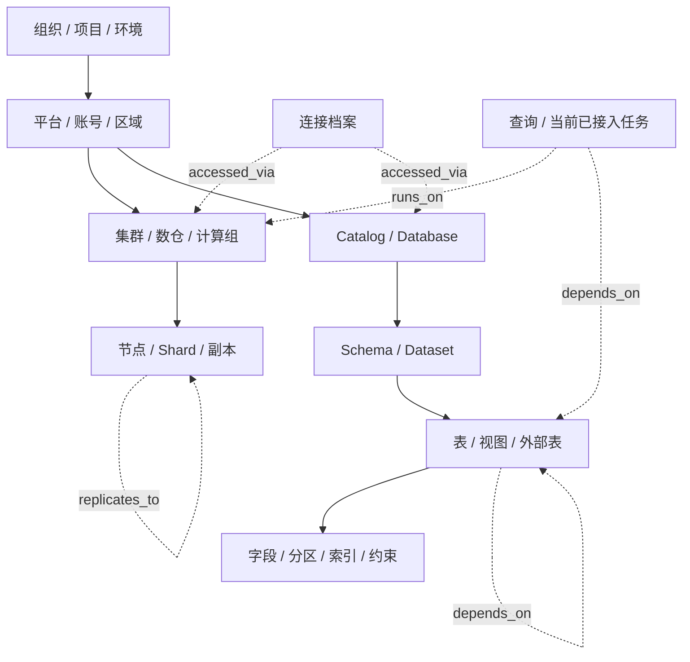
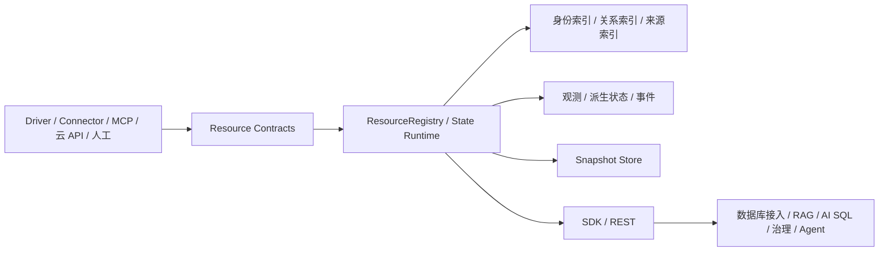

# DBAgent 公共基础能力：统一资源与状态模型

> 上级文档：[DBAgent 总体功能设计](../product-functional-overview.md)
>
> 关联文档：[数据库接入与能力描述](02-database-access.md)、[公共类型与合同](04-public-types-and-contracts.md)
>
> 文档性质：功能说明、工程架构与开发验收基线
> 当前状态：已实现并通过功能、故障恢复、SDK/API 与性能验收

## 1. 模块目的

本模块用同一套身份、关系、状态和变化模型描述数据库、数仓、集群、数据对象及当前已经接入的任务资源，为数据库接入、AI SQL、RAG、治理运维、Agent、MCP 和 Skills 提供可追溯的事实底座。

资源模型不等于数据库元数据树：

- 树形层级用于定位和展示，关系图用于表达依赖、复制、运行和访问入口。
- 资源事实、状态观测和变化事件分别保存，不能用一个“当前状态”覆盖历史。
- Driver、Connector、MCP、云 API 和人工配置可以共同描述同一资源，每条事实保留来源。
- 本模块不执行 SQL、不做 AI 诊断、不决定批准，也不保存 Secret。

## 2. 功能结构

```text
统一资源与状态模型
├─ 资源身份与范围
│  ├─ 稳定 ID、原生 ID 与别名
│  ├─ 租户、组织、项目、环境和区域
│  └─ 开放资源类型
├─ 层级与关系图
│  ├─ 包含、依赖、运行、复制和访问关系
│  ├─ 单跳查询与受限多跳遍历
│  └─ 关系完整性与层级环检测
├─ 状态三层模型
│  ├─ 资源事实
│  ├─ 状态观测
│  └─ 变化事件
├─ 来源与冲突
│  ├─ 来源、时间、有效期和置信度
│  ├─ 属性级事实保留与确定性解析
│  └─ 人工绑定、待合并与冲突展示
├─ 生命周期与变更
│  ├─ 全量发现、分页和增量变更
│  ├─ 幂等、乱序保护、软删除和恢复
│  └─ 快照、恢复和存储边界
└─ 访问与运行保障
   ├─ 范围隔离和分页
   ├─ 输入校验和 Secret 边界
   └─ 事件保留、观测压缩和性能指标
```

## 3. 资源身份与范围

### 3.1 资源身份

每个资源至少包含：

| 字段组 | 内容 |
|---|---|
| 身份 | 稳定内部 ID、资源类型、来源原生 ID |
| 名称 | 规范名称、展示名称、别名 |
| 范围 | 租户、组织、项目、环境、区域 |
| 技术 | 引擎或技术标识、版本 |
| 描述 | 标签、可传输扩展属性 |
| 版本 | 版本号、首次发现、最近更新、删除时间 |
| 来源 | 来源类型、来源 ID、连接引用、观测时间和有效期 |

身份规则：

1. 连接 ID、主机名和临时 Endpoint 不能单独作为物理资源 ID。
2. 同一来源命名空间、资源类型和原生 ID生成稳定 ID。
3. 名称变化更新资源，不自动创建新资源。
4. 不同类型不能共享同一资源 ID。
5. 无法确定是否相同的资源保持独立，只有显式绑定后才合并。
6. 绑定保留别名、来源、事实和关系，不静默丢弃重复资源证据。

### 3.2 开放资源类型

当前合同只枚举已经使用的资源类型，同时允许 Connector 或 MCP 使用带命名空间的扩展类型。当前类型包括：

- 组织、项目、环境、平台、账号和区域。
- 集群、节点、Shard、副本、计算组和存储组。
- Catalog、Database、Schema、表、视图、物化视图、外部表和字段。
- 分区、索引、约束、函数、过程、触发器、序列、角色和授权。
- 当前数据库接入已经产生的查询、任务和数据管道资源。

未来领域在实际开发时增加自己的资源类型；本模块不提前定义尚未出现的业务字段。

## 4. 层级与关系图



当前关系：

| 关系 | 含义 |
|---|---|
| `contains` | 层级包含 |
| `depends_on` | 数据或执行依赖 |
| `runs_on` | 任务运行位置 |
| `replicates_to` | 复制方向 |
| `accessed_via` | 访问入口 |
| `owned_by` | 资源所有者 |
| `member_of` | 集合或角色成员关系 |

关系规则：

- 起点和终点必须存在，关系不能指向自身。
- `contains` 关系不能形成环。
- 依赖关系允许真实系统中存在的环，但遍历必须有深度和结果上限。
- 软删除资源后，默认查询不返回以该资源为端点的有效关系。
- 关系和资源都保留版本、来源及删除标记。

## 5. 状态三层模型

### 5.1 资源事实

资源事实表示相对稳定的结构、配置和描述，例如：

- PostgreSQL 版本、表所有者和字段类型。
- 节点角色、可用区和复制目标。
- 对象估算规模和索引定义。

同一事实允许由多个来源报告。事实记录值、来源、时间和置信度，不能只保留最终覆盖值。

### 5.2 状态观测

状态观测表示有有效期的运行事实，例如：

- 健康、可用性和降级状态。
- 连接、容量、延迟和复制状态。
- 查询、任务或维护操作的当前状态。

观测必须包含：

- 资源 ID、类别和状态。
- 观测时间与过期时间。
- 来源。
- 可选指标、属性和采集错误。

过期观测保留为历史证据，但不能伪装成当前状态。

### 5.3 变化事件

资源运行时为当前已经发生的变更记录事件：

- 资源创建、更新、删除和恢复。
- 关系创建、更新和删除。
- 状态观测写入。
- 重复资源绑定。
- 增量变更集应用。

事件只记录变更摘要、关联 ID、来源、时间和序号，不复制 Secret 或无限复制完整资源内容。事件具有保留上限，可通过外部 Event Sink 持久化完整历史。

### 5.4 派生当前状态

当前状态由观测确定性计算，不调用大模型：

1. 按类别和来源选择截至 `asOf` 的最新观测。
2. 根据 `expiresAt` 区分 `fresh`、`stale` 和 `unknown`。
3. 同一类别存在不同有效状态时标记冲突。
4. 使用固定严重度顺序汇总整体状态：`unavailable`、`degraded`、`collecting`、`unknown`、`healthy`。
5. 自定义状态不被猜测为健康，按 `unknown` 参与整体汇总并保留原值。
6. 已删除资源的生命周期状态独立于健康状态。

返回结果必须包含采用的观测 ID、来源、冲突标记和计算时间，使上层能够解释状态依据。

## 6. 来源、合并与冲突

来源包括当前已接入的 `connector`、`driver`、`cloud-api`、`mcp` 和 `manual`，并允许命名空间扩展。

确定性解析顺序：

1. 显式来源优先级。
2. 事实置信度。
3. 观测时间。
4. 来源 ID 的稳定排序，用于完全相同时保持结果可复现。

规则：

- 同一来源的较新事实替换该来源的旧事实。
- 不同来源的事实同时保留。
- 不同值同时存在时返回冲突，不静默删除证据。
- 普通属性不能被较旧资源版本反向覆盖。
- 人工绑定必须由调用方显式触发，并记录事件。

## 7. 生命周期、增量与恢复

### 7.1 变更应用

- 全量发现页和增量变更集在写入前完成整体校验，失败不能留下半份数据。
- 同一来源和版本的变更集重复提交时返回幂等结果。
- 来源提供单调序号时，旧序号和重复序号不能覆盖新状态。
- 来源只提供不透明版本时，只保证相同版本幂等，不猜测版本大小关系。
- 删除使用软删除；恢复显式执行并增加版本。

### 7.2 快照与存储边界

资源运行时提供：

- 完整 Snapshot 导出和原子恢复。
- Snapshot 结构版本。
- 可替换的 `ResourceSnapshotStore`。
- 进程内存储实现，用于 SDK、测试和短生命周期服务。
- 原子 JSON 文件存储实现，用于本地单机持久化。

恢复规则：

- 先完整读取、校验并构建临时状态，再替换当前状态。
- 文件损坏、版本不支持或关系不完整时保持现有运行状态不变。
- 文件写入使用同目录临时文件和原子替换，避免部分写入。

大规模或多实例部署可以实现其他 Store，但不能改变资源公共合同。

## 8. 资源查询与隔离

运行时提供：

- 按 ID、类型、技术、文本和范围查询。
- 稳定游标分页。
- 单跳邻居和关系查询。
- 带方向、关系类型、深度及结果上限的多跳遍历。
- 当前状态和历史观测查询。
- 资源变化事件分页。
- 显式范围视图，确保租户、项目和环境过滤应用到资源及图遍历。

默认行为：

- 不返回软删除资源。
- 不返回端点不可见的关系。
- 不返回过期观测作为当前状态。
- 多跳遍历必须设置有限最大深度和最大资源数。
- 不允许通过关系绕过范围隔离。

## 9. 工程架构



当前工程归属：

| 组件 | 路径 |
|---|---|
| 资源公共合同 | [`resource.ts`](../../packages/shared/src/contracts/resource.ts) |
| 资源合同校验 | [`validation.ts`](../../packages/shared/src/contracts/validation.ts) |
| 资源注册、图查询与状态 | [`resource-registry.ts`](../../packages/core-resource/src/resource-registry.ts) |
| Snapshot Store | [`resource-snapshot-store.ts`](../../packages/core-resource/src/resource-snapshot-store.ts) |
| 包公共出口 | [`index.ts`](../../packages/core-resource/src/index.ts) |
| 数据库发现适配 | [`database-access-runtime.ts`](../../packages/core-db/src/database-access-runtime.ts) |
| SDK 入口 | [`runtime.ts`](../../packages/sdk/src/runtime.ts) |
| REST API | [`server.ts`](../../apps/server/src/server.ts) |
| 资源功能与恢复测试 | [`packages/core-resource/test`](../../packages/core-resource/test/) |
| SDK/API 集成测试 | [`runtime.test.ts`](../../packages/sdk/test/runtime.test.ts)、[`server.test.ts`](../../apps/server/test/server.test.ts) |
| 性能基准 | [`run-resource-state-benchmark.mjs`](../../scripts/run-resource-state-benchmark.mjs) |

`core-resource` 不依赖 `core-db`、`core-llm`、Agent、MCP 或 WebUI。数据库接入只向资源运行时提交标准资源、关系和观测。

## 10. 公共使用方式

### 10.1 SDK

```ts
const page = runtime.resources.query({
  kinds: ['table'],
  scope: { tenantId: 'team-a', environment: 'production' },
  limit: 100,
});

const graph = runtime.resources.traverse({
  startResourceIds: page.items.map((item) => item.id),
  direction: 'both',
  relationKinds: ['depends_on'],
  maxDepth: 2,
  maxResources: 500,
});

const state = runtime.resources.state(page.items[0]!.id);
```

### 10.2 REST API

| 方法与路径 | 用途 |
|---|---|
| `GET /v1/resources` | 范围过滤和分页查询 |
| `GET /v1/resources/:id` | 查询单个资源 |
| `GET /v1/resources/:id/relations` | 查询直接关系 |
| `POST /v1/resources/traverse` | 受限图遍历 |
| `GET /v1/resources/:id/state` | 查询派生当前状态 |
| `GET /v1/resources/:id/observations` | 查询观测历史 |
| `GET /v1/resource-events` | 查询变化事件 |

数据库专用发现入口继续由数据库接入模块提供；资源读取使用上述通用入口。

## 11. 功能验收

必须覆盖：

1. 稳定资源和关系 ID。
2. 身份不可变、名称可变和别名合并。
3. 多来源事实保留、优先级解析和冲突展示。
4. 较旧资源不能覆盖较新属性。
5. 关系完整性、自环拒绝和 `contains` 环拒绝。
6. 单跳和多跳遍历、环路终止及结果上限。
7. 范围隔离不能通过关系绕过。
8. 当前、过期、冲突和未知状态计算。
9. 观测去重与有界保留。
10. 全量页和变更集原子应用。
11. 重复版本幂等和单调序号乱序拒绝。
12. 软删除、恢复、绑定和关系可见性。
13. Snapshot 完整往返。
14. 损坏 Snapshot 恢复失败时原状态不变。
15. 文件持久化原子写入、重启恢复和临时文件清理。
16. 非法时间、版本、游标、来源、范围和不可传输属性拒绝。
17. 资源、观测、事件和 Snapshot 中不存在 Secret。

## 12. 性能验收

基准使用确定性内存数据，不包含外部数据库、磁盘或网络延迟。

| 指标 | 数据规模 | 目标 | 本地实测 |
|---|---:|---:|---:|
| 资源 ID 查询 P95 | 100,000 资源，2,000 次查询 | ≤ 10 ms | 0.0108 ms |
| 单跳关系查询 P95 | 100,000 关系，2,000 次查询 | ≤ 50 ms | 0.0227 ms |
| 两跳受限遍历 P95 | 100,000 关系，1,000 次查询 | ≤ 100 ms | 0.0553 ms |
| 范围与类型组合查询 P95 | 100,000 资源，1,000 次查询 | ≤ 50 ms | 0.8660 ms |
| 单资源增量更新 P95 | 10,000 次更新 | ≤ 5 ms | 0.0721 ms |
| 状态派生 P95 | 100,000 条有效观测 | ≤ 10 ms | 0.0085 ms |
| 重复观测有界保留 | 1,000,000 次同资源观测 | 不超过配置上限 | 保留 32/32 |
| 100,000 资源 Snapshot 恢复 | 完整资源与关系 | ≤ 5 s | 3.368 s |
| 事件保留 | 超过配置上限 | 内存数量不增长 | 保留 64/64 |

本地实测环境为 Node.js 24.14.0、Windows 10、Intel i9-13900HX；结果见 [`performance.json`](../../reports/resource-state/performance.json)。报告包含数据规模、环境、阈值、实际值和逐项结论。

## 13. 实际场景

**单 PostgreSQL**：Connector 发现实例、Database、Schema、表和字段。资源运行时稳定登记身份；表名称变化只更新资源，连接地址变化不产生第二个数据库。

**集群局部故障**：监控 MCP 报告一个副本不可用，Driver 仍报告主节点健康。系统分别保存两项观测，集群状态显示降级并指出具体副本和来源，不把整个集群简单标记为正常或失败。

**大型 Catalog 增量更新**：Connector 只提交一个表和相关关系的变更集。资源运行时校验版本后局部更新，RAG 和治理模块可以读取变化事件，不重建全部 Catalog。

**多来源冲突**：云 API 与人工配置报告不同所有者。系统保留两条事实，按明确优先级给出当前解析结果并标记冲突，Agent 可以解释采用依据。
