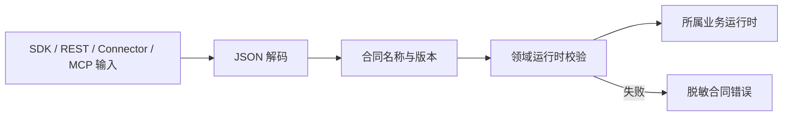

# SchemaNaut 公共基础能力：公共类型与合同

> 上级文档：[SchemaNaut 总体功能设计](../product-functional-overview.md)
>
> 关联文档：[大模型能力](01-llm-platform.md)、[数据库接入与能力描述](02-database-access.md)、[统一资源与状态模型](03-unified-resource-state.md)
>
> 文档性质：公共 API、类型组织、兼容性与开发验收基线
> 当前状态：已实现并通过类型、功能、兼容性、SDK/API、npm 与性能验收

## 1. 模块目的

本模块定义 SchemaNaut 当前已经实现能力之间共享的数据语言，使 SDK、REST API、CLI、WebUI、数据库 Connector 和内部运行时对同一请求、状态、错误和结果保持一致。

公共合同遵循“按开发增加”的原则：

- 只定义真正跨模块通用的基础语义，以及当前已经实现的资源和数据库领域合同。
- AI SQL、Agent、治理运维、MCP 和 Skills 在对应模块开发时增加自己的领域合同。
- 不提前猜测未来字段，不用一个万能请求、万能任务或万能状态承载所有业务。
- 公共合同描述可观察行为，不暴露 Driver、模型 Provider、存储和 WebUI 实现。

## 2. 功能结构

```text
公共类型与合同
├─ 通用基础合同
│  ├─ 合同名称与版本
│  ├─ 可传输值、时间和游标
│  ├─ Result 与公共错误字段
│  └─ 合同 Envelope
├─ 当前领域合同
│  ├─ 统一资源与状态
│  └─ 数据库连接、能力、查询和操作
├─ 运行时保障
│  ├─ 输入断言与错误路径
│  ├─ JSON 传输编码
│  ├─ Secret 字段检查
│  └─ 深拷贝与不可变边界
├─ 兼容性
│  ├─ 版本规则
│  ├─ 固定 Fixture
│  ├─ 废弃与迁移
│  └─ 包出口检查
└─ 质量
   ├─ 类型、功能和故障测试
   ├─ SDK/API 一致性
   └─ 校验与序列化性能
```

## 3. 合同设计原则

### 3.1 当前需要才增加

新增领域合同必须满足至少一个条件：

- 两个或以上当前模块需要交换该数据。
- SDK 或 REST API 已经需要公开该数据。
- Connector、MCP 或 Skills 当前需要通过稳定边界提交该数据。

仅用于单一实现内部的类型保留在所属包，不进入 `packages/shared`。

### 3.2 行为与实现分离

合同可以描述：

- 输入、输出和错误。
- 状态及允许的状态变化。
- 版本、来源和时间。
- 取消、幂等、分页和恢复语义。

合同不描述：

- 使用哪个数据库 Driver。
- 使用哪个模型 Provider。
- 内部 Map、连接池、文件或数据库表结构。
- WebUI 组件状态。

### 3.3 通用基础不等于万能模型

- 公共错误只统一基础字段，数据库错误保留数据库领域详情。
- 公共 Envelope 只负责版本和载荷，不强制所有内部方法返回 HTTP 风格结构。
- 当前数据库查询任务继续使用数据库任务状态；在真正出现跨领域任务编排时再设计通用任务合同。
- 当前模型调用类型继续由大模型模块所有；只有实际跨包复用的基础字段才上移。

## 4. 目录与工程归属

当前目录：

```text
packages/shared/src/
├─ contracts/
│  ├─ common.ts
│  ├─ resource.ts
│  ├─ database-sdk.ts
│  ├─ database-runtime.ts
│  ├─ database.ts
│  ├─ result.ts
│  ├─ validation.ts
│  └─ index.ts
└─ index.ts
```

职责：

| 文件                                                                             | 当前职责                                         |
| -------------------------------------------------------------------------------- | ------------------------------------------------ |
| [`common.ts`](../../packages/shared/src/contracts/common.ts)                     | 合同版本、Envelope、可传输值、公共错误基础字段   |
| [`resource.ts`](../../packages/shared/src/contracts/resource.ts)                 | 资源、关系、事实、观测、状态、事件和变更集       |
| [`database-sdk.ts`](../../packages/shared/src/contracts/database-sdk.ts)         | 已有 SDK 数据库连接、Schema 与执行结果合同       |
| [`database-runtime.ts`](../../packages/shared/src/contracts/database-runtime.ts) | 已有 SQL 安全、执行与运行时合同                  |
| [`database.ts`](../../packages/shared/src/contracts/database.ts)                 | 统一连接、能力、任务、事务、操作和数据库错误合同 |
| [`result.ts`](../../packages/shared/src/contracts/result.ts)                     | 类型安全的成功/失败结果                          |
| [`validation.ts`](../../packages/shared/src/contracts/validation.ts)             | 当前合同的运行时断言、传输编码和 Secret 检查     |
| [`index.ts`](../../packages/shared/src/contracts/index.ts)                       | 受控导出                                         |

原有散落在根目录的 `domain.ts`、`runtime-contracts.ts` 和 `result.ts` 已删除；现有数据库合同按职责迁入 `contracts/`。兼容性通过根包导出名称维持，不保留两份定义，也不预设 AI SQL、Agent、治理、MCP 或 Skills 的未来字段。

## 5. 通用基础合同

### 5.1 合同版本

初始公共合同版本为 `1.0`。

```ts
type ContractVersion = '1.0';

type ContractEnvelope<T> = {
  contract: string;
  version: ContractVersion;
  payload: T;
};
```

Envelope 用于跨进程、持久化 Snapshot、Fixture 和外部扩展边界。进程内函数可以直接使用具体类型。

### 5.2 可传输值

公共合同必须能够稳定通过 JSON、SDK、REST 和 MCP 边界。

直接支持：

- `string`
- 有限 `number`
- `boolean`
- `null`
- 数组
- 字符串键对象

Node.js 原生值使用显式标签编码：

| 原生值                | 传输形式                          |
| --------------------- | --------------------------------- |
| `bigint`              | 十进制字符串及 `bigint` 标签      |
| `Date`                | ISO 8601 字符串及 `datetime` 标签 |
| `Uint8Array`/`Buffer` | Base64 字符串及 `binary` 标签     |

拒绝：

- `undefined`
- `NaN` 和无穷数
- 函数、Symbol 和 Weak 引用
- 循环对象
- 非普通对象实例

解码只识别 SchemaNaut 自己的完整标签结构，普通业务对象不会被误解码。

### 5.3 公共错误基础

公共错误基础字段：

| 字段        | 含义                                 |
| ----------- | ------------------------------------ |
| `code`      | 稳定机器错误码                       |
| `message`   | 可向用户展示的简明信息               |
| `detail`    | 可选脱敏详情                         |
| `retryable` | 调用方能否按语义重试                 |
| `outcome`   | 当前动作确定未改变、已改变或结果未知 |
| `recovery`  | 可选恢复建议                         |

领域错误可以增加 `category`、`stage`、资源 ID、任务 ID 和 Provider 原始代码，但不能删除公共含义或返回 Secret。

## 6. 当前领域合同

### 6.1 资源领域

当前资源合同由[统一资源与状态模型](03-unified-resource-state.md)定义，包括：

- `ResourceDescriptor`
- `ResourceRelation`
- `ResourceFact`
- `ResourceObservation`
- `ResourceStateSnapshot`
- `ResourceEvent`
- `ResourceDiscoveryPage`
- `ResourceChangeSet`
- `ResourceQuery`
- `ResourceTraversalRequest/Result`
- `ResourceRegistrySnapshot`

### 6.2 数据库领域

当前数据库合同包括：

- 数据库值、表结构和连接合同。
- Connector Endpoint、Credential Reference 和连接会话。
- 动态能力、方言和限制。
- 查询提交、任务、阶段、成本、结果和分页批次。
- 事务、观测请求和原子运维操作。
- 数据库错误与审计事件。
- 当前 SDK 已经公开的 PostgreSQL 简化连接和执行合同。

简化 SDK 合同与统一数据库接入合同可以共存，但定义只能存在一处，并明确转换位置。它们表达不同抽象层时不强行合并成含义模糊的万能类型。

## 7. 运行时校验

TypeScript 类型不会在运行时保护外部输入，因此公共模块提供明确断言：

- `assertContractEnvelope`
- `assertResourceDescriptor`
- `assertResourceRelation`
- `assertResourceObservation`
- `assertResourceChangeSet`
- `assertConnectionProfile`
- `assertQuerySubmission`
- `assertDatabaseAccessError`

校验错误返回：

- 合同名称和版本。
- 精确字段路径。
- 稳定问题代码。
- 不包含输入中的 Secret 值。

校验规则至少覆盖：

- 必填字段和非空 ID。
- ISO 时间及时间顺序。
- 正整数版本、限制、超时和分页大小。
- 资源关系端点。
- 观测过期时间晚于观测时间。
- 合法状态和结果终态。
- 可传输扩展属性。
- Credential 只能以引用出现在公共 Profile 中。

## 8. Secret 边界

以下材料不能进入公共资源、状态、错误、审计、Fixture 和普通 API 响应：

- 密码。
- API Key 和访问 Token。
- 私钥。
- 数据库完整认证材料。
- 未脱敏连接字符串。

公共模块提供递归 Secret 字段检查，检查键名和典型凭据形态；该检查用于公共响应、Snapshot、Fixture 和测试。短期 `DatabaseCredential` 只允许存在于 Connector 调用边界，不允许 Envelope 化或持久化。

检查错误只报告路径和字段名，不回显值。

## 9. 版本与兼容性

### 9.1 兼容规则

`1.x` 内允许：

- 增加可选字段。
- 增加开放扩展值。
- 增加新的合同名称。
- 放宽不影响安全的输入限制。

`1.x` 内禁止：

- 删除或重命名已有字段。
- 将可选字段改为必填。
- 修改字段含义。
- 修改枚举值含义。
- 改变时间、金额、二进制或大整数编码。
- 改变错误码和状态的既有语义。

需要破坏性变化时增加主版本，并提供明确迁移函数或拒绝旧版本。

### 9.2 Fixture

每个公开合同至少保留一个不含 Secret 的版本化 JSON Fixture，用于验证：

- 当前代码能够读取已有 Fixture。
- 编码后仍符合固定结构。
- 新版本没有静默改变字段含义。
- npm 包导出的类型和运行时函数一致。

Fixture 是兼容性证据，不是完整业务样例库。

### 9.3 废弃

废弃公共名称时：

1. 保持原名称导出。
2. 标记 `@deprecated` 并给出替代名称。
3. 增加转换和兼容测试。
4. 只在下一个主版本删除。

内部重复实现不属于兼容层，应在当前模块开发中一并删除。

## 10. SDK、API 与包出口

一致性要求：

- SDK 和 REST 使用同一个公共合同定义。
- REST 输入先经过运行时断言，再进入业务运行时。
- REST 输出通过公共传输编码，不能直接依赖 `JSON.stringify` 对 Node.js 特殊值的偶然行为。
- CLI 和 WebUI 只消费 SDK/API 合同，不定义自己的状态枚举。
- npm 包必须导出公共类型、校验函数和当前合同版本。
- npm 解包后不能残留 `@dbagent/*` 工作区引用。

工程入口：

| 边界             | 代码与验收                                                                               |
| ---------------- | ---------------------------------------------------------------------------------------- |
| Shared 根出口    | [`packages/shared/src/index.ts`](../../packages/shared/src/index.ts)                     |
| SDK 根出口       | [`packages/sdk/src/index.ts`](../../packages/sdk/src/index.ts)                           |
| REST 输入与输出  | [`apps/server/src/server.ts`](../../apps/server/src/server.ts)                           |
| 合同功能测试     | [`packages/shared/test`](../../packages/shared/test/)                                    |
| v1 兼容 Fixture  | [`packages/shared/test/fixtures/v1`](../../packages/shared/test/fixtures/v1/)            |
| npm 独立解包验收 | [`verify-npm-package.mjs`](../../scripts/verify-npm-package.mjs)                         |
| 性能基准         | [`run-public-contracts-benchmark.mjs`](../../scripts/run-public-contracts-benchmark.mjs) |

## 11. 关键流程

### 11.1 外部输入



### 11.2 公共输出


Secret 检查只应用于明确禁止凭据的连接档案、资源、快照、错误和审计边界，不扫描或改写用户主动查询返回的业务列值。

## 12. 功能验收

必须覆盖：

1. 所有当前公共类型从根包稳定导出。
2. 合同 Envelope 创建、读取、未知版本拒绝和错误路径。
3. 普通 JSON 值无损往返。
4. `bigint`、`Date` 和二进制值稳定编码与解码。
5. `undefined`、非有限数、函数、Symbol、循环和类实例拒绝。
6. 资源、关系、观测、变更集、连接、查询和数据库错误逐字段校验。
7. 错误只包含安全路径，不回显非法 Secret 值。
8. Secret 检查覆盖嵌套对象、数组和大小写变体。
9. 固定 `v1` Fixture 往返和兼容性。
10. SDK、REST 和 npm 包使用同一合同版本。
11. TypeScript 声明中不存在重复冲突导出。
12. 删除旧源文件后不存在旧路径引用。
13. 合同包不依赖 Electron、Driver、模型 Provider 或原生模块。

## 13. 性能验收

基准只测公共合同处理开销，不包含业务运行时、数据库和网络。

| 指标                 |         数据规模 |    验收阈值 |
| -------------------- | ---------------: | ----------: |
| 资源合同校验 P95     |        10,000 次 |      ≤ 1 ms |
| 查询提交合同校验 P95 |        10,000 次 |      ≤ 1 ms |
| 普通对象传输编码 P95 |        10,000 次 |      ≤ 1 ms |
| 1,000 行混合结果编码 |         1,000 次 | P95 ≤ 10 ms |
| 10 MB 公共载荷编码   |             单次 |    ≤ 250 ms |
| Fixture 兼容检查     | 全部当前 Fixture |   100% 通过 |

[`performance.json`](../../reports/public-contracts/performance.json) 是 `generatedAt`、运行环境、数据规模、实测值、阈值和逐项结论的唯一事实来源；文档不复制会随机器与候选源码变化的历史数值。

## 14. 测试入口

目标测试分层：

```bash
pnpm test:public-contracts
pnpm test:public-contracts:compatibility
pnpm test:public-contracts:performance
pnpm test:resource-state
pnpm test:resource-state:performance
pnpm typecheck
pnpm lint
pnpm test
pnpm test:npm-package:functional
```

这里不设置冒烟测试。验收由确定性功能测试、故障与恢复测试、兼容性 Fixture、性能基准和 npm 独立解包功能测试组成。

## 15. 实际场景

**SDK 与 REST 一致**：SDK 提交数据库查询，REST 接收相同字段。两者使用同一个 `QuerySubmission`，非法超时都返回相同校验问题，不出现一端接受、一端拒绝。

**大整数结果**：数据库返回超过 JavaScript 安全整数范围的值。公共编码使用带类型标签的十进制字符串，浏览器不会精度丢失，SDK 可以显式恢复为 `bigint`。

**合同升级**：资源合同增加一个可选来源属性。已有 `v1` Fixture 和调用方继续通过；若要重命名稳定字段，则必须提高主版本并提供迁移。

**未来增加 AI SQL 合同**：只有当 AI SQL 模块开始开发并确定实际输入、状态和结果后，才增加 `contracts/ai-sql.ts`。公共模块不会提前构造猜测字段。
