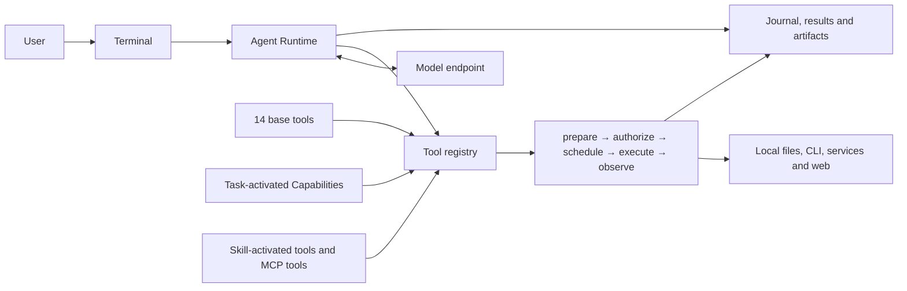
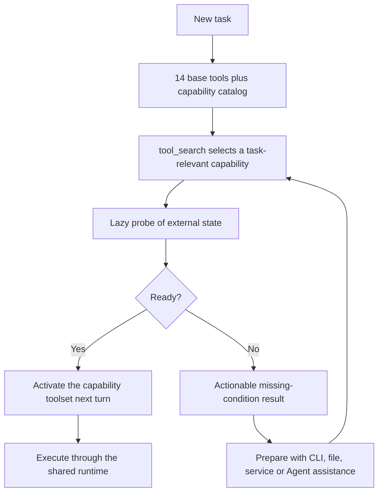
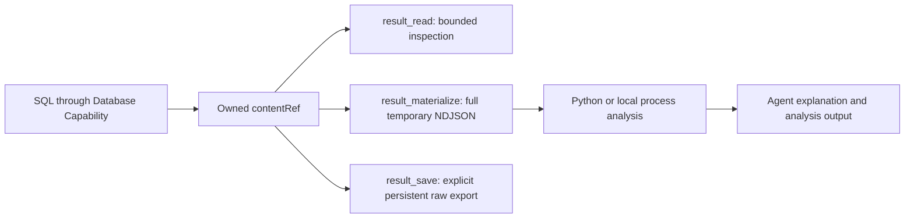

# 第一版发布与产品表达收口设计

## 1. 目标

本轮把已经实现的通用 Agent、基础 Tool、第一方 Capability 和数据结果管线，收口成一个用户能够理解、
安装并验证的 Alpha 产品。README 的首要任务不是罗列模块，而是回答三个问题：

1. 这个产品适合解决什么工作；
2. 为什么 Capability 架构能减少模型上下文、工具选择和命令试错成本；
3. 为什么它尤其适合数据库、Python、代码和本地工具协同的数据分析任务。

本轮不宣称全面优于 Claude Code、Codex 或其他 Agent。当前只表达能够由代码、合同和测试证明的架构优势；
横向优劣必须由后续可复现 Benchmark 给出。

## 2. 产品定位

SchemaNaut 当前定位为：

> 一个以终端为入口、模型中立、Capability 驱动的通用 Agent。它复用用户已经准备好的本地工具、服务和
> 登录状态，在同一耐久 Runtime 中组合代码、Git、数据库、浏览器、文档和数据分析任务。

目标用户是愿意管理本地项目、CLI 和模型 Endpoint，并需要跨多种真实工具完成工作的开发者与数据从业者。
它不是零配置 SaaS、传统数据库 IDE、公开 SDK、HTTP Server 或 WebUI。

## 3. README 必须突出但不得夸大的优势

### 3.1 Capability 减少工作成本，而不是增加配置层

- 首轮固定暴露 14 个基础 Tool 和 Capability 目录；专业工具按任务发现后再加载。
- Capability 是模型可调用的专业工具插件。它不拥有项目内或产品内配置页面。
- Git、数据库、Forge、容器、浏览器和语言工具继续使用用户在产品外维护的 CLI、环境变量、服务和登录态。
- 外部条件缺失时返回可行动诊断；用户可以自行配置，也可以让 Agent 通过普通 Tool 或 Capability 帮助动作完成准备。

用户收益是更少的工具 schema 进入首轮上下文、更少的命令组合试错，以及更稳定的专业动作语义。

### 3.2 通用 Agent 与数据执行管线结合

- Database Capability 返回本次调用的结果与 `contentRef`，不拥有整个 Run 的完成条件。
- `result_read` 只向模型提供有界样本。
- `result_materialize` 把完整原始结果复制为 Run-scoped 临时文件，Python 或本地进程可以直接处理完整数据。
- `result_save` 只在用户明确要求保存时，将原始结果 create-only、no-replace 地写入项目。

用户收益是可以用 SQL 缩小数据、用 Python 分析完整结果、再由 Agent 解释结论，而不需要把整份数据分页搬进
模型上下文。

### 3.3 模型、能力和执行治理解耦

- 模型负责理解任务和编排，Capability 提供稳定的专业动作。
- Capability 与 MCP 将动作注册为 Tool；Skill 文档进入模型上下文，不进入 Tool Registry。基础 Tool、
  Capability Tool、MCP Tool，以及 Skill 激活后由模型调用的 Tool 都进入
  `prepare → authorize → schedule → execute → observe` 主干。
- 权限只来自全局 `~/.schemanaut/config.toml` 的 `default`、`auto`、`full-access` 与企业规则。
- Journal、Run、Turn、Tool Invocation、结果引用和 Artifact 构成共同的耐久事实。

用户收益是可以更换模型连接而不重做 Capability 配置，并让跨工具长任务共享一致的权限、取消、恢复和结果语义。

## 4. README 架构图

README 中英文版本必须包含语义一致的三张 Mermaid 图。图后必须紧接用户收益说明，不能只展示内部模块。

### 4.1 统一 Agent Runtime

本图必须说明：所有工具来源共用一个执行边界；模型 Endpoint 与专业能力解耦；长任务事实可恢复。

### 4.2 Capability 渐进加载

本图必须说明：首轮工具面保持稳定；按任务加载降低上下文与选择成本；Capability 不引入新的产品配置层。

### 4.3 完整数据结果管线

本图必须说明：模型只检查必要样本；本地工具可以处理完整数据；临时消费和用户明确保存是两条不同路径；
Database Capability 不决定 Run 的最终态。

## 5. README 信息结构

中英文 README 使用以下相同顺序：

1. Hero：一句定位、Alpha 状态、唯一终端入口；
2. `Why SchemaNaut`：先写三至五项用户优势；
3. 三张架构图及其用户收益；
4. 适合与不适合的用户；
5. 从源码运行和最小全局 `config.toml` 示例；
6. 当前 14 个基础 Tool 和 8 类第一方 Capability；
7. 数据库与浏览器的必要外部条件；
8. 三档权限和简短责任边界；
9. Benchmark、用户文档、贡献和许可证入口。

安全与责任边界不能占据首屏。README 不声称自动 DLP、第三方信任判断、完整 OS 沙盒、普通浏览器标签页接管，
也不声称模型 Secret 只能通过引用配置；当前 schema 允许的配置形态必须如实描述，示例优先使用 `api_key_env`。
快速开始应使用一个已核对的真实 OpenAI-compatible Endpoint 示例，分别说明 PowerShell 与 bash 环境变量设置，
并把 `/config validate`、`/models` 和 `/doctor` 串成可完成的首次验证路径。

## 6. 文档分层

- `README.md`、`README.zh-CN.md`：用户价值、架构、快速开始和边界。
- `docs/README.md` 与 `docs/guides/`：用户操作手册。
- `docs/product/overview.md`、`docs/product/roadmap.md`：用户可见定位和方向。
- `docs/benchmarks/README.md`：公开评测目标、任务、指标和报告规则。
- `docs/engineering/`：代码地图、内部合同、发布和验证记录。
- `docs/superpowers/specs/` 与 `plans/`：内部设计与实施过程。

## 7. 横向评测合同

后续比较分为两层，不能混写结论：

### 7.1 同模型消融

在相同模型、Endpoint、任务、权限和环境下比较：

- 只有基础 Tool/命令执行；
- 基础 Tool 加按任务 Capability。

这一层用于测量 Capability 对成功率、Token、Turn、Tool 调用、重试和耗时的影响。

### 7.2 端到端 Agent 对比

使用各产品正常支持的默认模型和工具链比较 SchemaNaut、Claude Code、Codex 等产品。该层衡量用户最终体验，
不能把模型差异伪装成 Runtime 架构差异。

公共指标至少包括任务完成率、结果正确性、墙钟时间、输入/输出/缓存 Token、模型 Turn、Tool 调用、失败重试、
人工批准次数、发送给模型的结果字节数和中断恢复结果。所有报告必须记录版本、模型、环境、数据集、任务文本、
成功判据和未运行原因；不允许把 Provider 超时或缺少环境写成通过。

## 8. 发布收口

当前发布身份保持 `@nwlworkshop/schemanaut@0.1.0-alpha.2`、CLI `schemanaut` 和 npm `next` tag，直到用户确认
新的最终名称。名称迁移必须一次性覆盖仓库、包、CLI、配置目录、文档和发布脚本，不能在本轮制造双名称兼容层。

本地 npm 候选必须：

- 编译全部 Runtime workspace；
- 打包所有运行期内部依赖，包括第一方 Capability workspace；
- npm manifest 的外部运行时依赖必须精确覆盖 `RUNTIME_WORKSPACES` 各自 `dependencies` 的非 workspace 并集；
  该闭包由合同测试从 workspace manifest 推导，新增运行时库不能只在源码构建中可见而遗漏于发布包；
- 公共文档清单必须对仓库内相对 Markdown 链接闭包：任何已打包 README 或文档直接链接的本地 `.md` 文件也必须
  被打包，并继续接受同一闭包检查；npm 页面与安装目录中不得出现指向未随包交付文件的相对文档链接；
- 打包复制阶段、生成 manifest 的根文件入口和 tarball 必需文件验证必须共同派生于这份公共文档清单；
  不能再维护仅覆盖部分根 Markdown 的第二份固定列表。LICENSE、NOTICE 与第三方声明作为不参与文档导航闭包的
  固定法律/声明文件单独并入同一复制与必需文件计划；
- 不残留 `workspace:*` 或 `@dbagent/*` 导入；
- 通过 tarball 合同、校验和、provenance、隔离安装和 CLI smoke；
- 在 CI 中以独立 job 重复本地候选流程并上传候选证据，仍不执行远程 npm 发布；
- 不执行远程 npm 发布。

统一门禁中的 10k Tool Registry 合同必须在 120 秒测试预算内完成。Tool contribution 的名称、revision、权限、
owner 和 handler 绑定仍逐项验证；完全相同的 JSON Schema 可以复用“已成功编译”的进程内结果。缓存按规范化
Schema 文本键控、最多保留 1024 项，达到上限时整体清空；无效 Schema 不缓存。`$async` 禁止和 output 私有
result-envelope 禁止必须在缓存命中前检查，不能因为同一 Schema 曾作为 input 通过而绕过 output 边界。

工作区 no-replace 写入的失败清理由实际创建临时文件的一层负责。独占打开失败意味着该路径可能属于既有状态或
并发操作；上层不得把“尝试过写入”误当成“拥有该临时文件”并无条件删除。失败仍需取消源流、保留原始错误，且
预先存在的同名文件必须保持不变。仅持久化到 `prepared` 阶段也不证明临时文件已由本次操作创建；崩溃恢复在
这个阶段只能清理 Journal，进入 `temporary_ready` 后才可按现有恢复合同清理已创建临时文件。

结果物化根目录初始化同样必须容忍合法并发创建：逐层 `lstat` 后的 `mkdir` 若得到 `EEXIST`，必须重新读取并继续
既有的真实目录、非符号链接与目录身份验证，不能把另一个 Runtime 或配置 watcher 刚创建成功的目录误判为启动
失败，也不能改成跳过逐层验证的递归创建。若初始化确实失败，Runtime 关闭必须保留该原始错误并跳过未初始化
Store 的清理，不能用次生的“Store 未初始化”错误掩盖根因。

MCP 进程退出监听必须早于首次可能阻塞的工具发现请求。启动完成前退出继续按启动失败回滚，启动完成后退出必须
移除对应 generation；排队处理退出时还必须再次匹配产生事件的 client，旧连接的延迟事件不能误伤替换后的新
generation。真实进程测试用显式 crash 动作建立因果顺序，不依赖固定延时与启动阶段竞争。

## 9. 验收标准

- 中英文 README 的首屏先表达优势，而不是责任免责声明；
- 三张 Mermaid 图与实际代码合同一致，并分别解释用户收益；
- README 明确 14 个基础 Tool、8 类第一方 Capability、外部配置复用和数据结果管线；
- 用户文档不混入内部代码实现，工程文档不冒充用户手册；
- Benchmark 文档区分同模型消融和端到端横向对比，没有未经测量的优胜结论；
- npm 打包包含第一方 Capability、完整声明所有 Runtime workspace 的外部依赖，并对公共 Markdown 链接保持闭包；
  合同测试能阻止未来再次遗漏；
- CI 对 CLI-only npm 候选执行独立构建、验证与 Artifact 上传；
- 全仓 TypeScript typecheck 与 lint 不保留已知确定性错误；
- 10k Tool Registry 性能合同以 14 个当前基础 Tool 为基线，在测试预算内完成且不削弱逐 contribution 合同；
- 完整发布门禁记录真实通过、跳过和失败，不由文案替代验证；
- 不提交、不推送、不远程发布，也不在最终名称未确认前执行全仓重命名。
